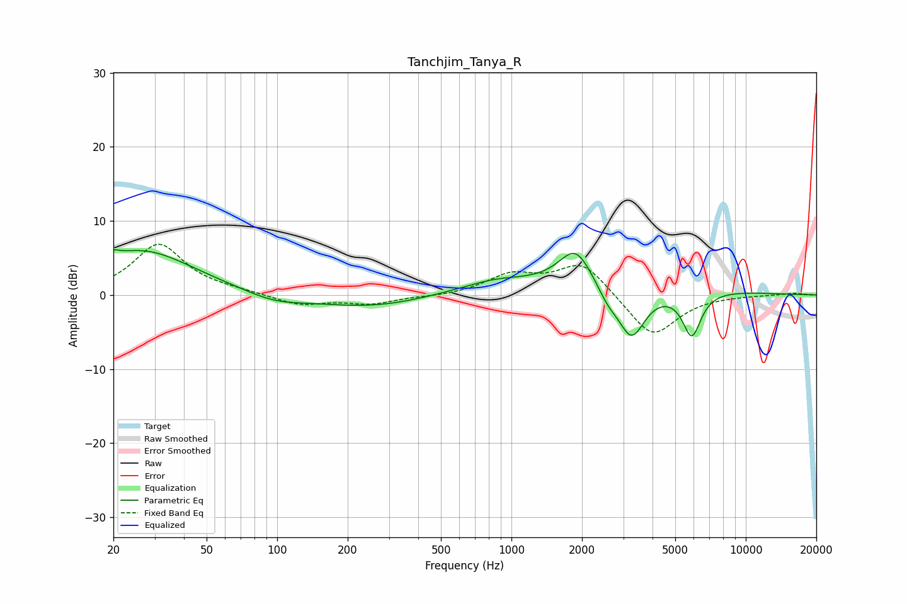

# Tanchjim_Tanya_R
See [usage instructions](https://github.com/jaakkopasanen/AutoEq#usage) for more options and info.

### Parametric EQs
Apply preamp of -6.2 dB when using parametric equalizer.

|   # | Type    |   Fc (Hz) |    Q |   Gain (dB) |
|-----|---------|-----------|------|-------------|
|   1 | Peaking |        20 | 5.99 |         0.8 |
|   2 | Peaking |        26 | 0.63 |         6   |
|   3 | Peaking |        97 | 1.15 |        -1.2 |
|   4 | Peaking |       270 | 0.54 |        -2.1 |
|   5 | Peaking |       857 | 1.13 |         0.9 |
|   6 | Peaking |      1661 | 0.19 |         1.6 |
|   7 | Peaking |      1876 | 2.02 |         5.1 |
|   8 | Peaking |      2578 | 3.11 |        -1.7 |
|   9 | Peaking |      3254 | 2.4  |        -6.9 |
|  10 | Peaking |      5881 | 3.48 |        -6.1 |

### Fixed Band EQs
When using fixed band (also called graphic) equalizer, apply preamp of **-6.9 dB** (if available) and set gains manually with these parameters.

|   # | Type    |   Fc (Hz) |    Q |   Gain (dB) |
|-----|---------|-----------|------|-------------|
|   1 | Peaking |        31 | 1.41 |         6.8 |
|   2 | Peaking |        62 | 1.41 |         0.4 |
|   3 | Peaking |       125 | 1.41 |        -1.4 |
|   4 | Peaking |       250 | 1.41 |        -1.1 |
|   5 | Peaking |       500 | 1.41 |        -0.2 |
|   6 | Peaking |      1000 | 1.41 |         2.6 |
|   7 | Peaking |      2000 | 1.41 |         4.5 |
|   8 | Peaking |      4000 | 1.41 |        -5.8 |
|   9 | Peaking |      8000 | 1.41 |        -0   |
|  10 | Peaking |     16000 | 1.41 |         0.3 |

### Graphs

