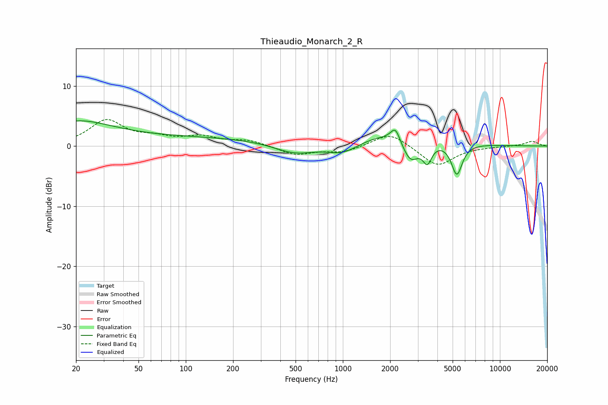

# Thieaudio_Monarch_2_R
See [usage instructions](https://github.com/jaakkopasanen/AutoEq#usage) for more options and info.

### Parametric EQs
Apply preamp of -4.3 dB when using parametric equalizer.

|   # | Type    |   Fc (Hz) |    Q |   Gain (dB) |
|-----|---------|-----------|------|-------------|
|   1 | Peaking |        20 | 0.66 |         3.1 |
|   2 | Peaking |        76 | 0.18 |         1.5 |
|   3 | Peaking |       496 | 1.04 |        -1.9 |
|   4 | Peaking |       921 | 3.87 |        -0.1 |
|   5 | Peaking |      1018 | 1.21 |        -2.4 |
|   6 | Peaking |      1886 | 0.49 |         2.7 |
|   7 | Peaking |      2161 | 4.92 |         2.3 |
|   8 | Peaking |      2698 | 2.61 |        -4   |
|   9 | Peaking |      3451 | 4.96 |        -3.1 |
|  10 | Peaking |      5320 | 4.04 |        -5.3 |

### Fixed Band EQs
When using fixed band (also called graphic) equalizer, apply preamp of **-4.5 dB** (if available) and set gains manually with these parameters.

|   # | Type    |   Fc (Hz) |    Q |   Gain (dB) |
|-----|---------|-----------|------|-------------|
|   1 | Peaking |        31 | 1.41 |         4.1 |
|   2 | Peaking |        62 | 1.41 |         1.1 |
|   3 | Peaking |       125 | 1.41 |         1.4 |
|   4 | Peaking |       250 | 1.41 |         0.9 |
|   5 | Peaking |       500 | 1.41 |        -1.5 |
|   6 | Peaking |      1000 | 1.41 |        -1   |
|   7 | Peaking |      2000 | 1.41 |         2.4 |
|   8 | Peaking |      4000 | 1.41 |        -3.4 |
|   9 | Peaking |      8000 | 1.41 |        -0.1 |
|  10 | Peaking |     16000 | 1.41 |         0.8 |

### Graphs

