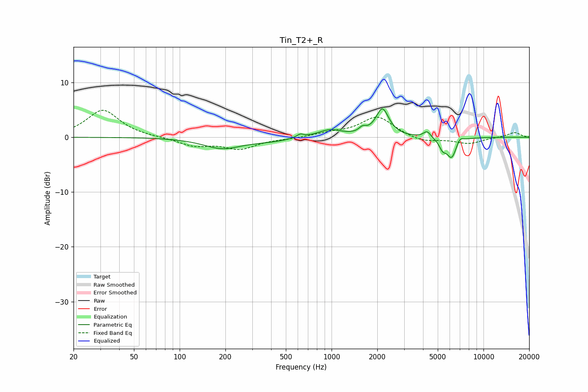

# Tin_T2+_R
See [usage instructions](https://github.com/jaakkopasanen/AutoEq#usage) for more options and info.

### Parametric EQs
Apply preamp of -5.3 dB when using parametric equalizer.

|   # | Type    |   Fc (Hz) |    Q |   Gain (dB) |
|-----|---------|-----------|------|-------------|
|   1 | Peaking |       191 | 1.13 |        -1.9 |
|   2 | Peaking |       392 | 1.02 |        -0.6 |
|   3 | Peaking |       622 | 5.86 |         0.6 |
|   4 | Peaking |       974 | 1.79 |         1.4 |
|   5 | Peaking |      1599 | 6    |         0.9 |
|   6 | Peaking |      2160 | 3.35 |         5   |
|   7 | Peaking |      4255 | 6    |         1.2 |
|   8 | Peaking |      5383 | 6    |        -1.6 |
|   9 | Peaking |      6176 | 4.22 |        -3.7 |
|  10 | Peaking |      6981 | 6    |         1   |

### Fixed Band EQs
When using fixed band (also called graphic) equalizer, apply preamp of **-5.0 dB** (if available) and set gains manually with these parameters.

|   # | Type    |   Fc (Hz) |    Q |   Gain (dB) |
|-----|---------|-----------|------|-------------|
|   1 | Peaking |        31 | 1.41 |         5   |
|   2 | Peaking |        62 | 1.41 |        -0   |
|   3 | Peaking |       125 | 1.41 |        -1.5 |
|   4 | Peaking |       250 | 1.41 |        -2   |
|   5 | Peaking |       500 | 1.41 |        -0.2 |
|   6 | Peaking |      1000 | 1.41 |         0.7 |
|   7 | Peaking |      2000 | 1.41 |         3.8 |
|   8 | Peaking |      4000 | 1.41 |        -1   |
|   9 | Peaking |      8000 | 1.41 |        -1.1 |
|  10 | Peaking |     16000 | 1.41 |         0.9 |

### Graphs

