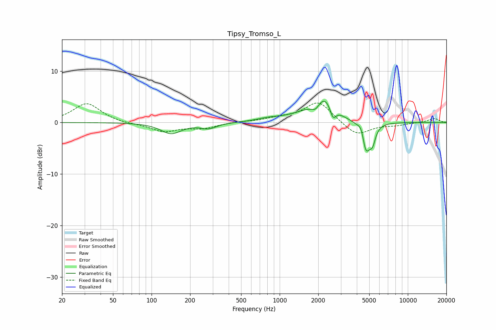

# Tipsy_Tromso_L
See [usage instructions](https://github.com/jaakkopasanen/AutoEq#usage) for more options and info.

### Parametric EQs
Apply preamp of -4.2 dB when using parametric equalizer.

|   # | Type    |   Fc (Hz) |    Q |   Gain (dB) |
|-----|---------|-----------|------|-------------|
|   1 | Peaking |       142 | 1.76 |        -2.1 |
|   2 | Peaking |       279 | 2.26 |        -1.1 |
|   3 | Peaking |       820 | 1.53 |         0.5 |
|   4 | Peaking |      1558 | 1.07 |         1.3 |
|   5 | Peaking |      1910 | 4.44 |        -1.4 |
|   6 | Peaking |      2249 | 1.86 |         4.4 |
|   7 | Peaking |      2605 | 5.94 |        -2.5 |
|   8 | Peaking |      4350 | 6    |         2   |
|   9 | Peaking |      4701 | 4.22 |        -6   |
|  10 | Peaking |      5308 | 6    |        -2.8 |

### Fixed Band EQs
When using fixed band (also called graphic) equalizer, apply preamp of **-3.9 dB** (if available) and set gains manually with these parameters.

|   # | Type    |   Fc (Hz) |    Q |   Gain (dB) |
|-----|---------|-----------|------|-------------|
|   1 | Peaking |        31 | 1.41 |         3.7 |
|   2 | Peaking |        62 | 1.41 |        -0.3 |
|   3 | Peaking |       125 | 1.41 |        -1.7 |
|   4 | Peaking |       250 | 1.41 |        -1   |
|   5 | Peaking |       500 | 1.41 |         0.2 |
|   6 | Peaking |      1000 | 1.41 |         0.7 |
|   7 | Peaking |      2000 | 1.41 |         4.1 |
|   8 | Peaking |      4000 | 1.41 |        -2.7 |
|   9 | Peaking |      8000 | 1.41 |        -0.5 |
|  10 | Peaking |     16000 | 1.41 |         0.8 |

### Graphs

