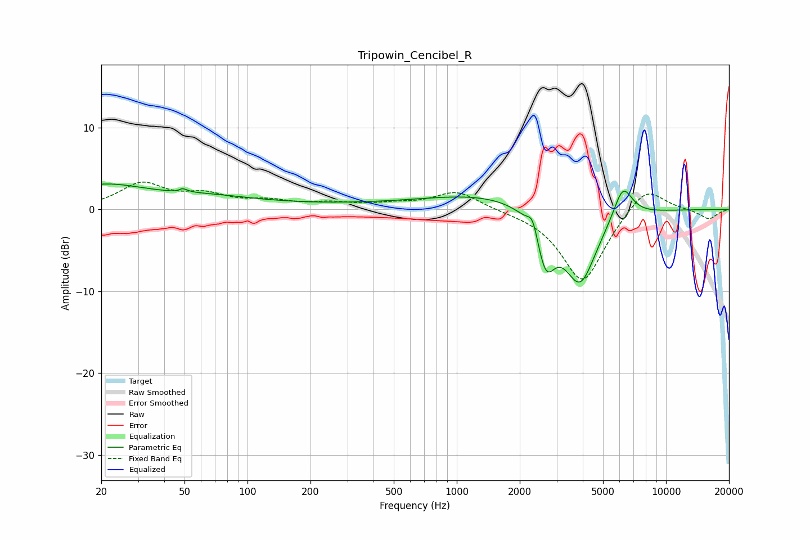

# Tripowin_Cencibel_R
See [usage instructions](https://github.com/jaakkopasanen/AutoEq#usage) for more options and info.

### Parametric EQs
Apply preamp of -3.2 dB when using parametric equalizer.

|   # | Type    |   Fc (Hz) |    Q |   Gain (dB) |
|-----|---------|-----------|------|-------------|
|   1 | Peaking |        20 | 0.67 |         2.8 |
|   2 | Peaking |        48 | 5.92 |        -1.8 |
|   3 | Peaking |        48 | 5.97 |         2.2 |
|   4 | Peaking |        65 | 0.61 |         1.1 |
|   5 | Peaking |       457 | 0.18 |         0.5 |
|   6 | Peaking |      1525 | 0.47 |         1.6 |
|   7 | Peaking |      2306 | 5.99 |         2.1 |
|   8 | Peaking |      2664 | 3.15 |        -6.1 |
|   9 | Peaking |      3883 | 1.71 |        -9.3 |
|  10 | Peaking |      6219 | 3.02 |         4.2 |

### Fixed Band EQs
When using fixed band (also called graphic) equalizer, apply preamp of **-3.4 dB** (if available) and set gains manually with these parameters.

|   # | Type    |   Fc (Hz) |    Q |   Gain (dB) |
|-----|---------|-----------|------|-------------|
|   1 | Peaking |        31 | 1.41 |         3   |
|   2 | Peaking |        62 | 1.41 |         1.5 |
|   3 | Peaking |       125 | 1.41 |         0.8 |
|   4 | Peaking |       250 | 1.41 |         0.6 |
|   5 | Peaking |       500 | 1.41 |         0.5 |
|   6 | Peaking |      1000 | 1.41 |         2.2 |
|   7 | Peaking |      2000 | 1.41 |        -0.1 |
|   8 | Peaking |      4000 | 1.41 |        -9   |
|   9 | Peaking |      8000 | 1.41 |         3.2 |
|  10 | Peaking |     16000 | 1.41 |        -1.2 |

### Graphs

