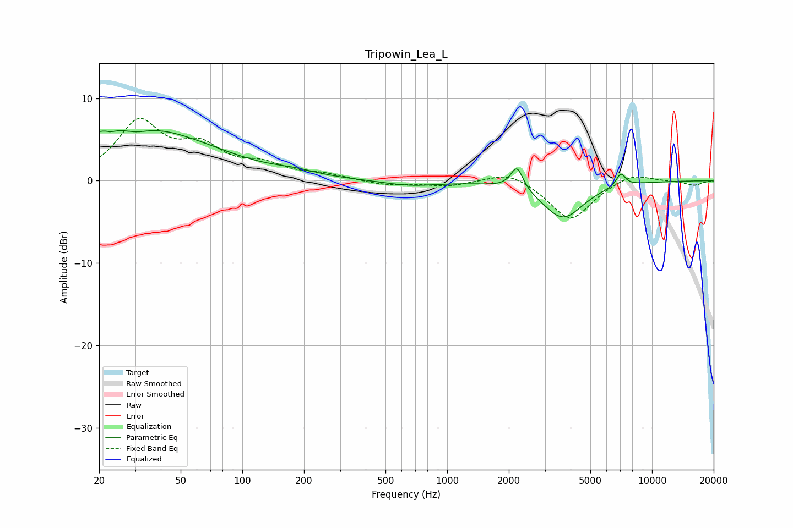

# Tripowin_Lea_L
See [usage instructions](https://github.com/jaakkopasanen/AutoEq#usage) for more options and info.

### Parametric EQs
Apply preamp of -6.2 dB when using parametric equalizer.

|   # | Type    |   Fc (Hz) |    Q |   Gain (dB) |
|-----|---------|-----------|------|-------------|
|   1 | Peaking |        22 | 5.69 |         3.3 |
|   2 | Peaking |        22 | 5.48 |        -3.6 |
|   3 | Peaking |        25 | 0.37 |         1.8 |
|   4 | Peaking |        30 | 0.37 |         4.9 |
|   5 | Peaking |        30 | 2.27 |        -0.7 |
|   6 | Peaking |       181 | 1.3  |         0.5 |
|   7 | Peaking |       661 | 1.06 |        -0.6 |
|   8 | Peaking |      2189 | 4.8  |         2.8 |
|   9 | Peaking |      3674 | 1.41 |        -4.5 |
|  10 | Peaking |      7044 | 5.91 |         1.6 |

### Fixed Band EQs
When using fixed band (also called graphic) equalizer, apply preamp of **-7.7 dB** (if available) and set gains manually with these parameters.

|   # | Type    |   Fc (Hz) |    Q |   Gain (dB) |
|-----|---------|-----------|------|-------------|
|   1 | Peaking |        31 | 1.41 |         6.8 |
|   2 | Peaking |        62 | 1.41 |         3.5 |
|   3 | Peaking |       125 | 1.41 |         1.6 |
|   4 | Peaking |       250 | 1.41 |         0.6 |
|   5 | Peaking |       500 | 1.41 |        -0.5 |
|   6 | Peaking |      1000 | 1.41 |        -0.6 |
|   7 | Peaking |      2000 | 1.41 |         1.3 |
|   8 | Peaking |      4000 | 1.41 |        -4.8 |
|   9 | Peaking |      8000 | 1.41 |         1.1 |
|  10 | Peaking |     16000 | 1.41 |        -0.6 |

### Graphs

