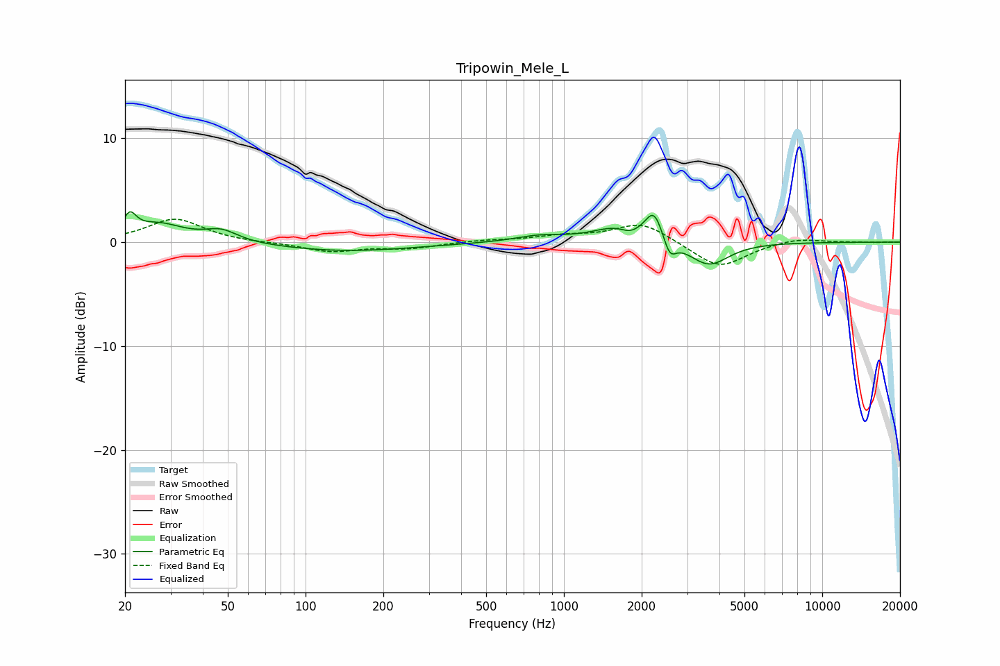

# Tripowin_Mele_L
See [usage instructions](https://github.com/jaakkopasanen/AutoEq#usage) for more options and info.

### Parametric EQs
Apply preamp of -3.0 dB when using parametric equalizer.

|   # | Type    |   Fc (Hz) |    Q |   Gain (dB) |
|-----|---------|-----------|------|-------------|
|   1 | Peaking |        21 | 5.86 |         1.8 |
|   2 | Peaking |        27 | 1.39 |         1.7 |
|   3 | Peaking |        47 | 2.25 |         1.1 |
|   4 | Peaking |       142 | 0.53 |        -0.9 |
|   5 | Peaking |       803 | 1.5  |         0.6 |
|   6 | Peaking |      1634 | 1.46 |         1.5 |
|   7 | Peaking |      1796 | 3.9  |        -0.6 |
|   8 | Peaking |      2233 | 4.23 |         2.8 |
|   9 | Peaking |      2569 | 5.99 |        -1.7 |
|  10 | Peaking |      3634 | 1.84 |        -2.3 |

### Fixed Band EQs
When using fixed band (also called graphic) equalizer, apply preamp of **-2.3 dB** (if available) and set gains manually with these parameters.

|   # | Type    |   Fc (Hz) |    Q |   Gain (dB) |
|-----|---------|-----------|------|-------------|
|   1 | Peaking |        31 | 1.41 |         2.2 |
|   2 | Peaking |        62 | 1.41 |        -0.1 |
|   3 | Peaking |       125 | 1.41 |        -0.9 |
|   4 | Peaking |       250 | 1.41 |        -0.6 |
|   5 | Peaking |       500 | 1.41 |         0.2 |
|   6 | Peaking |      1000 | 1.41 |         0.5 |
|   7 | Peaking |      2000 | 1.41 |         1.9 |
|   8 | Peaking |      4000 | 1.41 |        -2.5 |
|   9 | Peaking |      8000 | 1.41 |         0.5 |
|  10 | Peaking |     16000 | 1.41 |        -0   |

### Graphs

