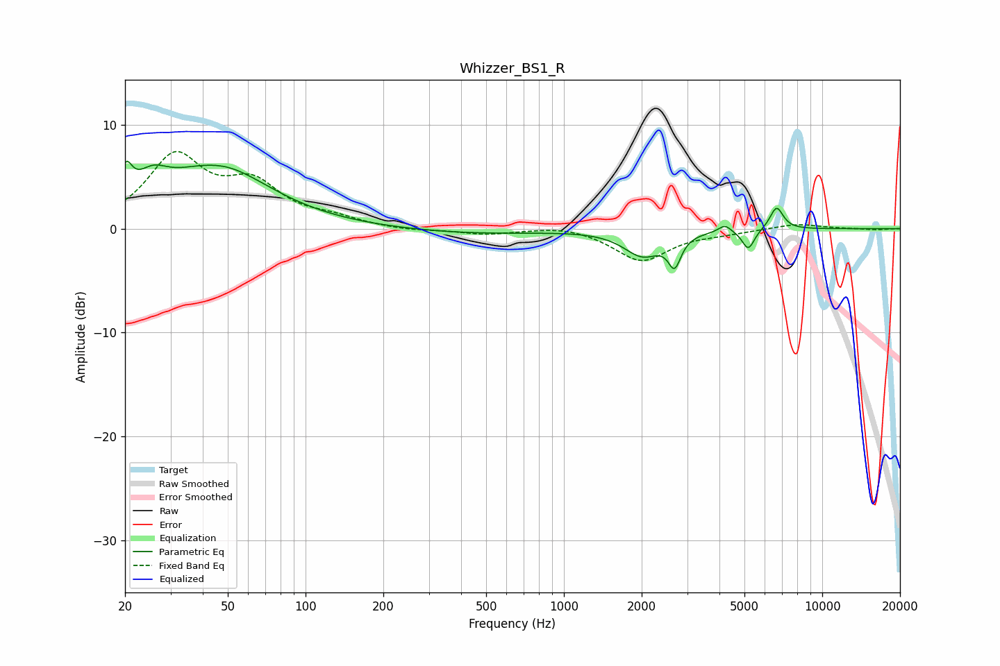

# Whizzer_BS1_R
See [usage instructions](https://github.com/jaakkopasanen/AutoEq#usage) for more options and info.

### Parametric EQs
Apply preamp of -6.6 dB when using parametric equalizer.

|   # | Type    |   Fc (Hz) |    Q |   Gain (dB) |
|-----|---------|-----------|------|-------------|
|   1 | Peaking |        20 | 5.94 |         3   |
|   2 | Peaking |        25 | 2.3  |         2.2 |
|   3 | Peaking |        43 | 1.8  |        -0.2 |
|   4 | Peaking |        45 | 0.7  |         6.1 |
|   5 | Peaking |       444 | 0.52 |        -0.5 |
|   6 | Peaking |      2019 | 1.93 |        -2.5 |
|   7 | Peaking |      2682 | 5.85 |        -2.7 |
|   8 | Peaking |      4194 | 6    |         0.7 |
|   9 | Peaking |      5175 | 5.85 |        -2   |
|  10 | Peaking |      6657 | 5.34 |         2.2 |

### Fixed Band EQs
When using fixed band (also called graphic) equalizer, apply preamp of **-7.5 dB** (if available) and set gains manually with these parameters.

|   # | Type    |   Fc (Hz) |    Q |   Gain (dB) |
|-----|---------|-----------|------|-------------|
|   1 | Peaking |        31 | 1.41 |         6.7 |
|   2 | Peaking |        62 | 1.41 |         3.8 |
|   3 | Peaking |       125 | 1.41 |         0.8 |
|   4 | Peaking |       250 | 1.41 |        -0.2 |
|   5 | Peaking |       500 | 1.41 |        -0.5 |
|   6 | Peaking |      1000 | 1.41 |         0.4 |
|   7 | Peaking |      2000 | 1.41 |        -3.1 |
|   8 | Peaking |      4000 | 1.41 |        -0.3 |
|   9 | Peaking |      8000 | 1.41 |         0.5 |
|  10 | Peaking |     16000 | 1.41 |        -0.1 |

### Graphs

