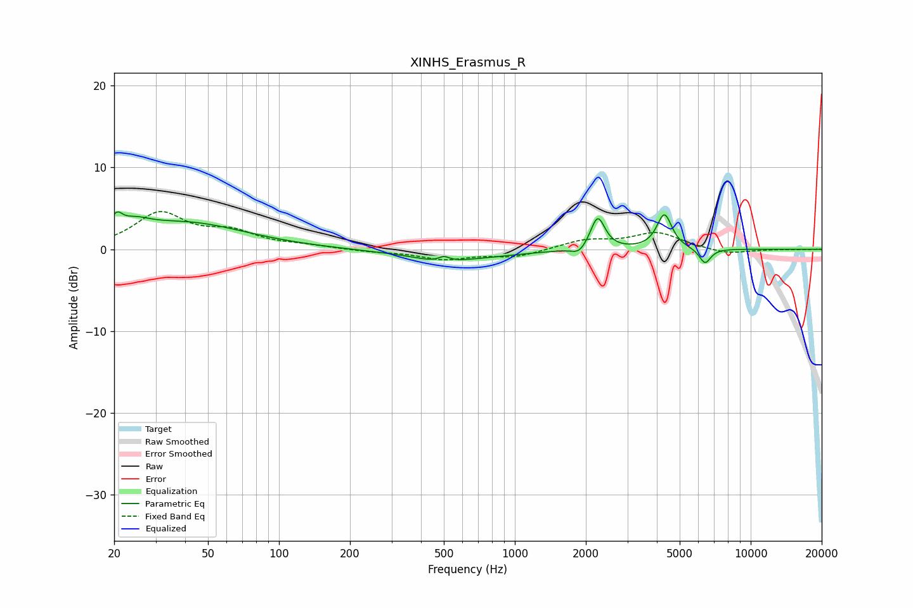

# XINHS_Erasmus_R
See [usage instructions](https://github.com/jaakkopasanen/AutoEq#usage) for more options and info.

### Parametric EQs
Apply preamp of -4.7 dB when using parametric equalizer.

|   # | Type    |   Fc (Hz) |    Q |   Gain (dB) |
|-----|---------|-----------|------|-------------|
|   1 | Peaking |        20 | 5.98 |         1.8 |
|   2 | Peaking |        24 | 2.21 |         1.3 |
|   3 | Peaking |        40 | 0.56 |         3.2 |
|   4 | Peaking |       481 | 1.94 |        -0.5 |
|   5 | Peaking |       501 | 5.9  |         0.7 |
|   6 | Peaking |       557 | 0.65 |        -1.2 |
|   7 | Peaking |      1876 | 4.72 |        -0.9 |
|   8 | Peaking |      2245 | 4.7  |         4   |
|   9 | Peaking |      4304 | 4.5  |         4.3 |
|  10 | Peaking |      6402 | 5.66 |        -1.9 |

### Fixed Band EQs
When using fixed band (also called graphic) equalizer, apply preamp of **-4.7 dB** (if available) and set gains manually with these parameters.

|   # | Type    |   Fc (Hz) |    Q |   Gain (dB) |
|-----|---------|-----------|------|-------------|
|   1 | Peaking |        31 | 1.41 |         4.3 |
|   2 | Peaking |        62 | 1.41 |         1.8 |
|   3 | Peaking |       125 | 1.41 |         0.4 |
|   4 | Peaking |       250 | 1.41 |        -0.3 |
|   5 | Peaking |       500 | 1.41 |        -1.2 |
|   6 | Peaking |      1000 | 1.41 |        -0.9 |
|   7 | Peaking |      2000 | 1.41 |         1.1 |
|   8 | Peaking |      4000 | 1.41 |         2   |
|   9 | Peaking |      8000 | 1.41 |        -0.6 |
|  10 | Peaking |     16000 | 1.41 |        -0   |

### Graphs

