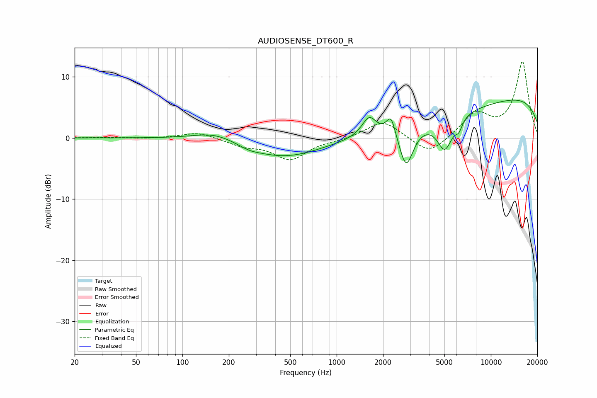

# AUDIOSENSE_DT600_R
See [usage instructions](https://github.com/jaakkopasanen/AutoEq#usage) for more options and info.

### Parametric EQs
Apply preamp of -6.3 dB when using parametric equalizer.

|   # | Type    |   Fc (Hz) |    Q |   Gain (dB) |
|-----|---------|-----------|------|-------------|
|   1 | Peaking |       164 | 1.01 |         1.5 |
|   2 | Peaking |       270 | 2.16 |        -0.5 |
|   3 | Peaking |       450 | 0.58 |        -3.2 |
|   4 | Peaking |      1625 | 3.05 |         3.1 |
|   5 | Peaking |      2253 | 4.86 |         3.3 |
|   6 | Peaking |      2823 | 3.03 |        -6.7 |
|   7 | Peaking |      4619 | 0.29 |        -3   |
|   8 | Peaking |      5030 | 2.8  |        -5.4 |
|   9 | Peaking |      6203 | 6    |        -1.6 |
|  10 | Peaking |      9654 | 0.18 |         7.9 |

### Fixed Band EQs
When using fixed band (also called graphic) equalizer, apply preamp of **-12.6 dB** (if available) and set gains manually with these parameters.

|   # | Type    |   Fc (Hz) |    Q |   Gain (dB) |
|-----|---------|-----------|------|-------------|
|   1 | Peaking |        31 | 1.41 |         0.1 |
|   2 | Peaking |        62 | 1.41 |        -0.1 |
|   3 | Peaking |       125 | 1.41 |         1   |
|   4 | Peaking |       250 | 1.41 |        -1.1 |
|   5 | Peaking |       500 | 1.41 |        -3.4 |
|   6 | Peaking |      1000 | 1.41 |        -0.3 |
|   7 | Peaking |      2000 | 1.41 |         2.9 |
|   8 | Peaking |      4000 | 1.41 |        -2.9 |
|   9 | Peaking |      8000 | 1.41 |         3.9 |
|  10 | Peaking |     16000 | 1.41 |        12.4 |

### Graphs

