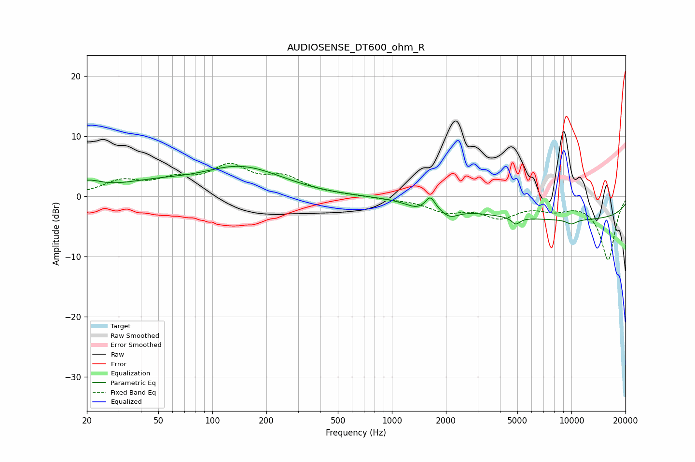

# AUDIOSENSE_DT600_ohm_R
See [usage instructions](https://github.com/jaakkopasanen/AutoEq#usage) for more options and info.

### Parametric EQs
Apply preamp of -5.1 dB when using parametric equalizer.

|   # | Type    |   Fc (Hz) |    Q |   Gain (dB) |
|-----|---------|-----------|------|-------------|
|   1 | Peaking |        20 | 1.81 |         1.8 |
|   2 | Peaking |        48 | 0.66 |         1.8 |
|   3 | Peaking |       135 | 0.72 |         3.5 |
|   4 | Peaking |       201 | 0.74 |         1.3 |
|   5 | Peaking |      1369 | 2.42 |        -0.9 |
|   6 | Peaking |      1637 | 5.58 |         2.1 |
|   7 | Peaking |      2096 | 2.85 |        -1.5 |
|   8 | Peaking |      4896 | 5.97 |        -1.2 |
|   9 | Peaking |     10000 | 0.18 |        -3.9 |
|  10 | Peaking |     10000 | 4.21 |        -0.8 |

### Fixed Band EQs
When using fixed band (also called graphic) equalizer, apply preamp of **-5.6 dB** (if available) and set gains manually with these parameters.

|   # | Type    |   Fc (Hz) |    Q |   Gain (dB) |
|-----|---------|-----------|------|-------------|
|   1 | Peaking |        31 | 1.41 |         2.3 |
|   2 | Peaking |        62 | 1.41 |         2.2 |
|   3 | Peaking |       125 | 1.41 |         4.5 |
|   4 | Peaking |       250 | 1.41 |         2.7 |
|   5 | Peaking |       500 | 1.41 |         0.1 |
|   6 | Peaking |      1000 | 1.41 |        -0.3 |
|   7 | Peaking |      2000 | 1.41 |        -2.2 |
|   8 | Peaking |      4000 | 1.41 |        -3.1 |
|   9 | Peaking |      8000 | 1.41 |        -1.7 |
|  10 | Peaking |     16000 | 1.41 |       -10.5 |

### Graphs

