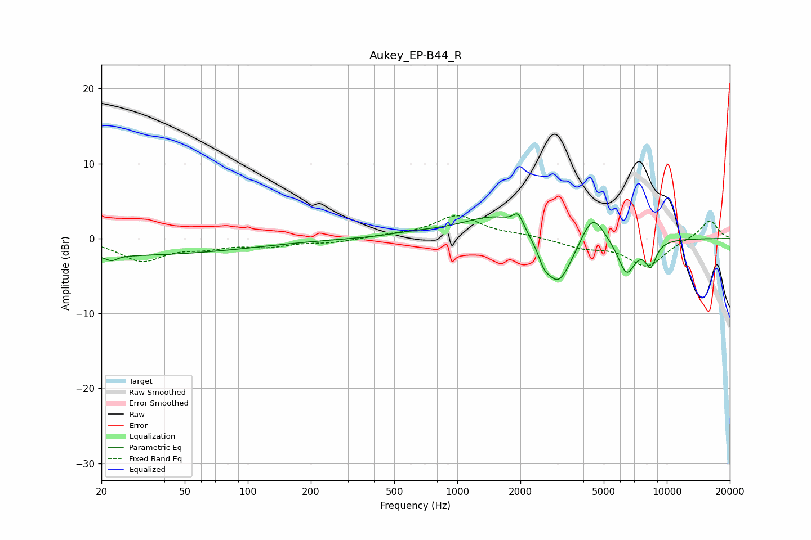

# Aukey_EP-B44_R
See [usage instructions](https://github.com/jaakkopasanen/AutoEq#usage) for more options and info.

### Parametric EQs
Apply preamp of -3.4 dB when using parametric equalizer.

|   # | Type    |   Fc (Hz) |    Q |   Gain (dB) |
|-----|---------|-----------|------|-------------|
|   1 | Peaking |        20 | 0.18 |        -2.3 |
|   2 | Peaking |        22 | 5.61 |        -0.7 |
|   3 | Peaking |       625 | 1.27 |         0.4 |
|   4 | Peaking |      1602 | 0.82 |         3.4 |
|   5 | Peaking |      1952 | 5.95 |         1.8 |
|   6 | Peaking |      2589 | 5.39 |        -1.5 |
|   7 | Peaking |      3027 | 2.02 |        -7.2 |
|   8 | Peaking |      4426 | 2.59 |         4.1 |
|   9 | Peaking |      6426 | 3.25 |        -4.7 |
|  10 | Peaking |      8377 | 4.86 |        -3.2 |

### Fixed Band EQs
When using fixed band (also called graphic) equalizer, apply preamp of **-3.1 dB** (if available) and set gains manually with these parameters.

|   # | Type    |   Fc (Hz) |    Q |   Gain (dB) |
|-----|---------|-----------|------|-------------|
|   1 | Peaking |        31 | 1.41 |        -2.9 |
|   2 | Peaking |        62 | 1.41 |        -1   |
|   3 | Peaking |       125 | 1.41 |        -0.9 |
|   4 | Peaking |       250 | 1.41 |        -0.5 |
|   5 | Peaking |       500 | 1.41 |         0.3 |
|   6 | Peaking |      1000 | 1.41 |         3   |
|   7 | Peaking |      2000 | 1.41 |         0.4 |
|   8 | Peaking |      4000 | 1.41 |        -1.1 |
|   9 | Peaking |      8000 | 1.41 |        -3.7 |
|  10 | Peaking |     16000 | 1.41 |         2.5 |

### Graphs

