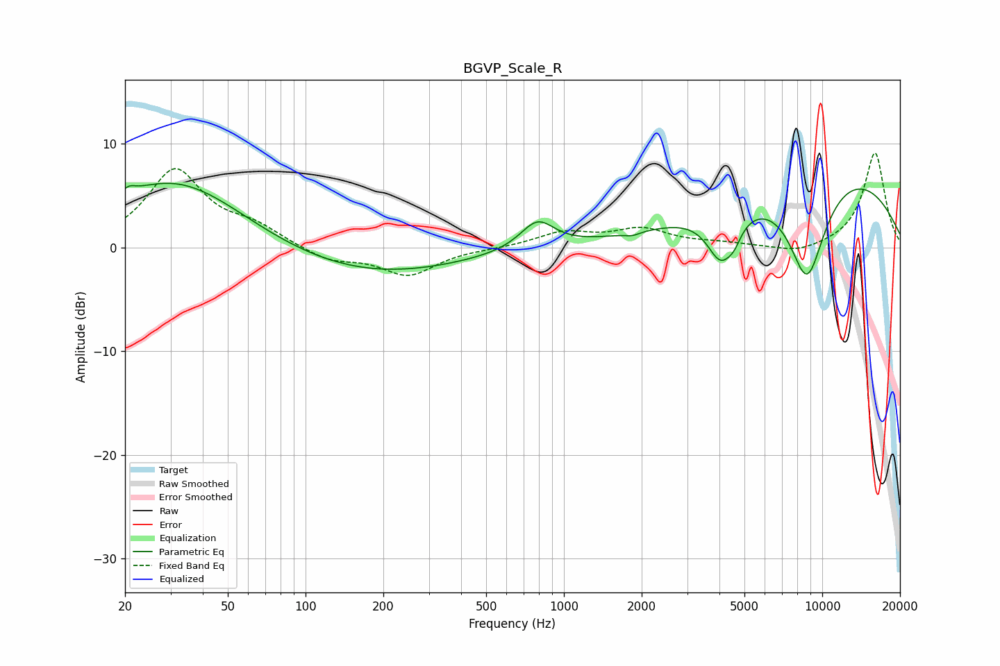

# BGVP_Scale_R
See [usage instructions](https://github.com/jaakkopasanen/AutoEq#usage) for more options and info.

### Parametric EQs
Apply preamp of -6.3 dB when using parametric equalizer.

|   # | Type    |   Fc (Hz) |    Q |   Gain (dB) |
|-----|---------|-----------|------|-------------|
|   1 | Peaking |        21 | 6    |         0.6 |
|   2 | Peaking |        32 | 0.5  |         7   |
|   3 | Peaking |        56 | 0.38 |         1.5 |
|   4 | Peaking |       108 | 0.29 |        -4   |
|   5 | Peaking |       790 | 2.14 |         2.7 |
|   6 | Peaking |      1840 | 4.97 |        -0.3 |
|   7 | Peaking |      4064 | 2.51 |        -4.9 |
|   8 | Peaking |      4576 | 5.45 |        -1   |
|   9 | Peaking |      8732 | 1.67 |       -10.3 |
|  10 | Peaking |      9933 | 0.3  |         8.1 |

### Fixed Band EQs
When using fixed band (also called graphic) equalizer, apply preamp of **-9.2 dB** (if available) and set gains manually with these parameters.

|   # | Type    |   Fc (Hz) |    Q |   Gain (dB) |
|-----|---------|-----------|------|-------------|
|   1 | Peaking |        31 | 1.41 |         7.3 |
|   2 | Peaking |        62 | 1.41 |         1.6 |
|   3 | Peaking |       125 | 1.41 |        -1.3 |
|   4 | Peaking |       250 | 1.41 |        -2.6 |
|   5 | Peaking |       500 | 1.41 |        -0.1 |
|   6 | Peaking |      1000 | 1.41 |         1.4 |
|   7 | Peaking |      2000 | 1.41 |         1.6 |
|   8 | Peaking |      4000 | 1.41 |         0.3 |
|   9 | Peaking |      8000 | 1.41 |        -0.7 |
|  10 | Peaking |     16000 | 1.41 |         9.2 |

### Graphs

