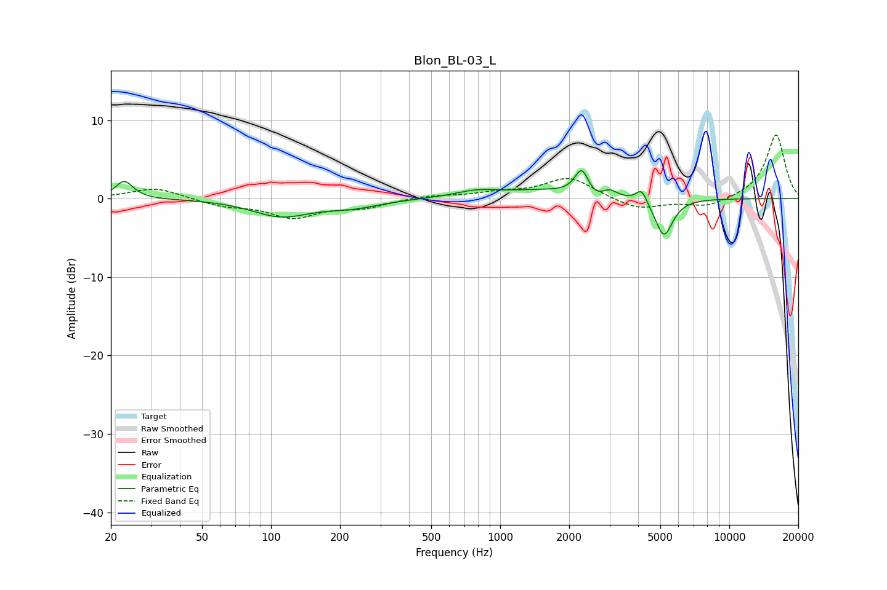

# Blon_BL-03_L
See [usage instructions](https://github.com/jaakkopasanen/AutoEq#usage) for more options and info.

### Parametric EQs
Apply preamp of -3.7 dB when using parametric equalizer.

|   # | Type    |   Fc (Hz) |    Q |   Gain (dB) |
|-----|---------|-----------|------|-------------|
|   1 | Peaking |        23 | 3.75 |         2.3 |
|   2 | Peaking |       110 | 1.14 |        -2.1 |
|   3 | Peaking |       225 | 1.14 |        -0.9 |
|   4 | Peaking |       788 | 1.51 |         0.7 |
|   5 | Peaking |      1604 | 0.72 |         1.1 |
|   6 | Peaking |      2274 | 4.47 |         3.7 |
|   7 | Peaking |      2573 | 2.18 |        -1.5 |
|   8 | Peaking |      2983 | 3.93 |         1.2 |
|   9 | Peaking |      4139 | 6    |         1.7 |
|  10 | Peaking |      5182 | 3.64 |        -4.9 |

### Fixed Band EQs
When using fixed band (also called graphic) equalizer, apply preamp of **-8.2 dB** (if available) and set gains manually with these parameters.

|   # | Type    |   Fc (Hz) |    Q |   Gain (dB) |
|-----|---------|-----------|------|-------------|
|   1 | Peaking |        31 | 1.41 |         1.4 |
|   2 | Peaking |        62 | 1.41 |        -0.9 |
|   3 | Peaking |       125 | 1.41 |        -2.3 |
|   4 | Peaking |       250 | 1.41 |        -1   |
|   5 | Peaking |       500 | 1.41 |         0.4 |
|   6 | Peaking |      1000 | 1.41 |         0.6 |
|   7 | Peaking |      2000 | 1.41 |         2.7 |
|   8 | Peaking |      4000 | 1.41 |        -1.5 |
|   9 | Peaking |      8000 | 1.41 |        -1.1 |
|  10 | Peaking |     16000 | 1.41 |         8.2 |

### Graphs

