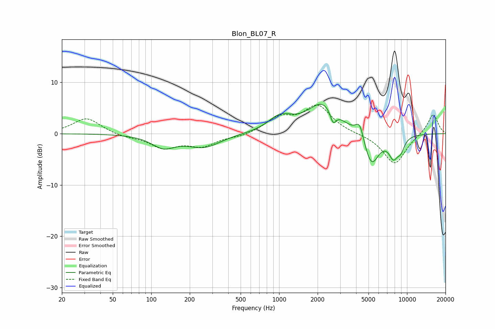

# Blon_BL07_R
See [usage instructions](https://github.com/jaakkopasanen/AutoEq#usage) for more options and info.

### Parametric EQs
Apply preamp of -5.8 dB when using parametric equalizer.

|   # | Type    |   Fc (Hz) |    Q |   Gain (dB) |
|-----|---------|-----------|------|-------------|
|   1 | Peaking |       125 | 1.55 |        -2.4 |
|   2 | Peaking |       258 | 1.1  |        -2.5 |
|   3 | Peaking |      1020 | 1.52 |         2.8 |
|   4 | Peaking |      2218 | 1.15 |         6   |
|   5 | Peaking |      2645 | 5.97 |        -2.6 |
|   6 | Peaking |      4275 | 4.2  |         3.4 |
|   7 | Peaking |      5180 | 4.31 |         0.7 |
|   8 | Peaking |      5233 | 2.38 |        -7.4 |
|   9 | Peaking |      7833 | 3.57 |        -3.7 |
|  10 | Peaking |      8951 | 4.36 |        -2.2 |

### Fixed Band EQs
When using fixed band (also called graphic) equalizer, apply preamp of **-5.7 dB** (if available) and set gains manually with these parameters.

|   # | Type    |   Fc (Hz) |    Q |   Gain (dB) |
|-----|---------|-----------|------|-------------|
|   1 | Peaking |        31 | 1.41 |         3.1 |
|   2 | Peaking |        62 | 1.41 |        -0.6 |
|   3 | Peaking |       125 | 1.41 |        -2.6 |
|   4 | Peaking |       250 | 1.41 |        -2.2 |
|   5 | Peaking |       500 | 1.41 |        -0.6 |
|   6 | Peaking |      1000 | 1.41 |         2.8 |
|   7 | Peaking |      2000 | 1.41 |         5.3 |
|   8 | Peaking |      4000 | 1.41 |        -0   |
|   9 | Peaking |      8000 | 1.41 |        -6   |
|  10 | Peaking |     16000 | 1.41 |         4   |

### Graphs

