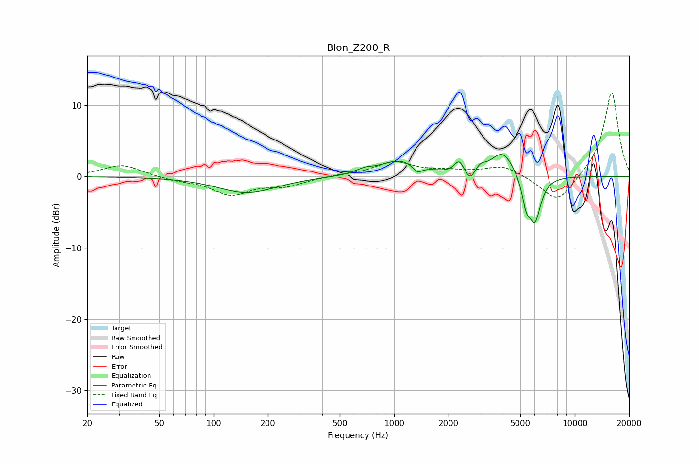

# Blon_Z200_R
See [usage instructions](https://github.com/jaakkopasanen/AutoEq#usage) for more options and info.

### Parametric EQs
Apply preamp of -3.2 dB when using parametric equalizer.

|   # | Type    |   Fc (Hz) |    Q |   Gain (dB) |
|-----|---------|-----------|------|-------------|
|   1 | Peaking |       153 | 0.88 |        -2.3 |
|   2 | Peaking |       686 | 2.95 |         0.6 |
|   3 | Peaking |      1079 | 1.3  |         2.2 |
|   4 | Peaking |      1346 | 5.31 |        -1.1 |
|   5 | Peaking |      2284 | 6    |         1.6 |
|   6 | Peaking |      2639 | 6    |        -1.5 |
|   7 | Peaking |      3010 | 5.25 |         0.8 |
|   8 | Peaking |      3986 | 2.21 |         3.5 |
|   9 | Peaking |      5384 | 6    |        -3.3 |
|  10 | Peaking |      6017 | 4.14 |        -6.2 |

### Fixed Band EQs
When using fixed band (also called graphic) equalizer, apply preamp of **-11.8 dB** (if available) and set gains manually with these parameters.

|   # | Type    |   Fc (Hz) |    Q |   Gain (dB) |
|-----|---------|-----------|------|-------------|
|   1 | Peaking |        31 | 1.41 |         1.7 |
|   2 | Peaking |        62 | 1.41 |        -0.5 |
|   3 | Peaking |       125 | 1.41 |        -2.4 |
|   4 | Peaking |       250 | 1.41 |        -1.2 |
|   5 | Peaking |       500 | 1.41 |         0.2 |
|   6 | Peaking |      1000 | 1.41 |         2   |
|   7 | Peaking |      2000 | 1.41 |         0.6 |
|   8 | Peaking |      4000 | 1.41 |         1.5 |
|   9 | Peaking |      8000 | 1.41 |        -3.9 |
|  10 | Peaking |     16000 | 1.41 |        12   |

### Graphs

