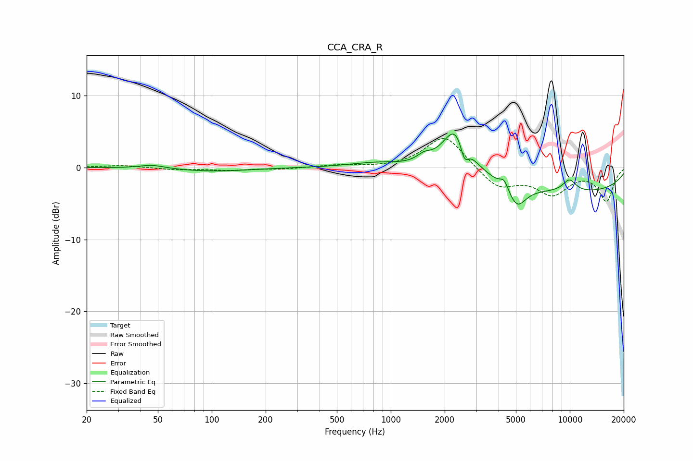

# CCA_CRA_R
See [usage instructions](https://github.com/jaakkopasanen/AutoEq#usage) for more options and info.

### Parametric EQs
Apply preamp of -4.7 dB when using parametric equalizer.

|   # | Type    |   Fc (Hz) |    Q |   Gain (dB) |
|-----|---------|-----------|------|-------------|
|   1 | Peaking |        46 | 1.99 |         0.5 |
|   2 | Peaking |       100 | 0.68 |        -0.5 |
|   3 | Peaking |       830 | 0.95 |         0.7 |
|   4 | Peaking |      1531 | 3.54 |         1   |
|   5 | Peaking |      2325 | 1.86 |         6.8 |
|   6 | Peaking |      2574 | 5.98 |        -2.9 |
|   7 | Peaking |      4298 | 5.85 |         1.3 |
|   8 | Peaking |      5063 | 2.8  |        -3   |
|   9 | Peaking |      9942 | 3.21 |         1.7 |
|  10 | Peaking |     10000 | 0.22 |        -3.4 |

### Fixed Band EQs
When using fixed band (also called graphic) equalizer, apply preamp of **-4.1 dB** (if available) and set gains manually with these parameters.

|   # | Type    |   Fc (Hz) |    Q |   Gain (dB) |
|-----|---------|-----------|------|-------------|
|   1 | Peaking |        31 | 1.41 |         0.3 |
|   2 | Peaking |        62 | 1.41 |        -0.3 |
|   3 | Peaking |       125 | 1.41 |        -0.4 |
|   4 | Peaking |       250 | 1.41 |        -0.2 |
|   5 | Peaking |       500 | 1.41 |         0.3 |
|   6 | Peaking |      1000 | 1.41 |        -0.1 |
|   7 | Peaking |      2000 | 1.41 |         4.6 |
|   8 | Peaking |      4000 | 1.41 |        -2.9 |
|   9 | Peaking |      8000 | 1.41 |        -3.4 |
|  10 | Peaking |     16000 | 1.41 |        -4.6 |

### Graphs

