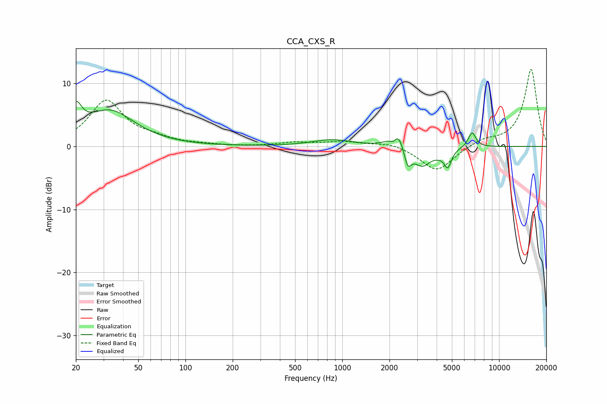

# CCA_CXS_R
See [usage instructions](https://github.com/jaakkopasanen/AutoEq#usage) for more options and info.

### Parametric EQs
Apply preamp of -7.2 dB when using parametric equalizer.

|   # | Type    |   Fc (Hz) |    Q |   Gain (dB) |
|-----|---------|-----------|------|-------------|
|   1 | Peaking |        20 | 3.91 |         4.1 |
|   2 | Peaking |        33 | 0.9  |         5.5 |
|   3 | Peaking |       859 | 1.12 |         1   |
|   4 | Peaking |      2131 | 5.88 |        -1.9 |
|   5 | Peaking |      2216 | 3.44 |         3.9 |
|   6 | Peaking |      2613 | 5.99 |        -3.1 |
|   7 | Peaking |      3223 | 2.51 |        -3   |
|   8 | Peaking |      4095 | 3.78 |        -0.5 |
|   9 | Peaking |      4707 | 5.94 |        -2.8 |
|  10 | Peaking |      6727 | 5.69 |         2.4 |

### Fixed Band EQs
When using fixed band (also called graphic) equalizer, apply preamp of **-12.3 dB** (if available) and set gains manually with these parameters.

|   # | Type    |   Fc (Hz) |    Q |   Gain (dB) |
|-----|---------|-----------|------|-------------|
|   1 | Peaking |        31 | 1.41 |         7.2 |
|   2 | Peaking |        62 | 1.41 |         0.9 |
|   3 | Peaking |       125 | 1.41 |         0.2 |
|   4 | Peaking |       250 | 1.41 |        -0   |
|   5 | Peaking |       500 | 1.41 |         0.6 |
|   6 | Peaking |      1000 | 1.41 |         0.7 |
|   7 | Peaking |      2000 | 1.41 |         0.7 |
|   8 | Peaking |      4000 | 1.41 |        -4   |
|   9 | Peaking |      8000 | 1.41 |         1   |
|  10 | Peaking |     16000 | 1.41 |        12.3 |

### Graphs

