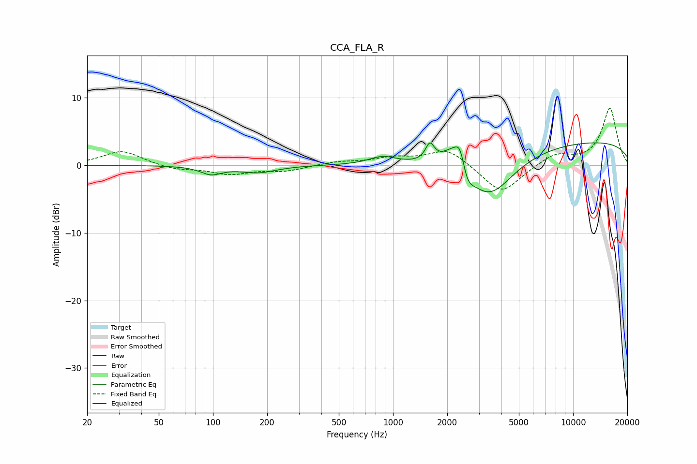

# CCA_FLA_R
See [usage instructions](https://github.com/jaakkopasanen/AutoEq#usage) for more options and info.

### Parametric EQs
Apply preamp of -3.4 dB when using parametric equalizer.

|   # | Type    |   Fc (Hz) |    Q |   Gain (dB) |
|-----|---------|-----------|------|-------------|
|   1 | Peaking |        98 | 2.45 |        -1.2 |
|   2 | Peaking |       177 | 1.39 |        -1   |
|   3 | Peaking |       875 | 1.91 |         1.1 |
|   4 | Peaking |      1602 | 5.88 |         2.5 |
|   5 | Peaking |      2243 | 2.03 |         4.4 |
|   6 | Peaking |      2365 | 5.89 |         2.5 |
|   7 | Peaking |      2523 | 2.21 |         0.2 |
|   8 | Peaking |      2561 | 3.88 |        -3.2 |
|   9 | Peaking |      3368 | 0.99 |        -7.4 |
|  10 | Peaking |     10000 | 0.18 |         3.7 |

### Fixed Band EQs
When using fixed band (also called graphic) equalizer, apply preamp of **-8.5 dB** (if available) and set gains manually with these parameters.

|   # | Type    |   Fc (Hz) |    Q |   Gain (dB) |
|-----|---------|-----------|------|-------------|
|   1 | Peaking |        31 | 1.41 |         2.2 |
|   2 | Peaking |        62 | 1.41 |        -0.6 |
|   3 | Peaking |       125 | 1.41 |        -1.2 |
|   4 | Peaking |       250 | 1.41 |        -0.8 |
|   5 | Peaking |       500 | 1.41 |         0.5 |
|   6 | Peaking |      1000 | 1.41 |         1   |
|   7 | Peaking |      2000 | 1.41 |         2.5 |
|   8 | Peaking |      4000 | 1.41 |        -4.3 |
|   9 | Peaking |      8000 | 1.41 |         1.7 |
|  10 | Peaking |     16000 | 1.41 |         8.4 |

### Graphs

