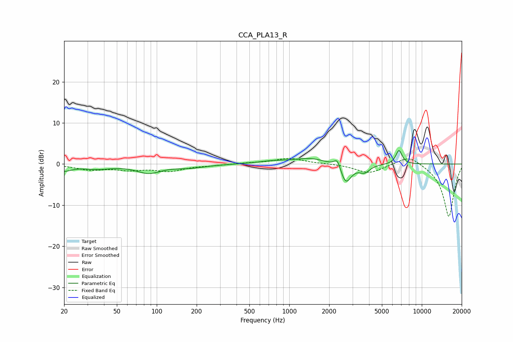

# CCA_PLA13_R
See [usage instructions](https://github.com/jaakkopasanen/AutoEq#usage) for more options and info.

### Parametric EQs
Apply preamp of -3.4 dB when using parametric equalizer.

|   # | Type    |   Fc (Hz) |    Q |   Gain (dB) |
|-----|---------|-----------|------|-------------|
|   1 | Peaking |        20 | 2.55 |        -1.4 |
|   2 | Peaking |        35 | 1.3  |        -1   |
|   3 | Peaking |        87 | 1.58 |        -2   |
|   4 | Peaking |       177 | 1.18 |        -0.8 |
|   5 | Peaking |       746 | 1.27 |         0.6 |
|   6 | Peaking |      1446 | 1.13 |         1.4 |
|   7 | Peaking |      2306 | 5.97 |         2.4 |
|   8 | Peaking |      2670 | 3.45 |        -4.9 |
|   9 | Peaking |      3692 | 3.51 |        -1.8 |
|  10 | Peaking |      6726 | 5.77 |         3.4 |

### Fixed Band EQs
When using fixed band (also called graphic) equalizer, apply preamp of **-1.5 dB** (if available) and set gains manually with these parameters.

|   # | Type    |   Fc (Hz) |    Q |   Gain (dB) |
|-----|---------|-----------|------|-------------|
|   1 | Peaking |        31 | 1.41 |        -1.3 |
|   2 | Peaking |        62 | 1.41 |        -1.2 |
|   3 | Peaking |       125 | 1.41 |        -1.6 |
|   4 | Peaking |       250 | 1.41 |        -0.3 |
|   5 | Peaking |       500 | 1.41 |         0.2 |
|   6 | Peaking |      1000 | 1.41 |         1.4 |
|   7 | Peaking |      2000 | 1.41 |         0.1 |
|   8 | Peaking |      4000 | 1.41 |        -2.2 |
|   9 | Peaking |      8000 | 1.41 |         2.4 |
|  10 | Peaking |     16000 | 1.41 |       -12.9 |

### Graphs

