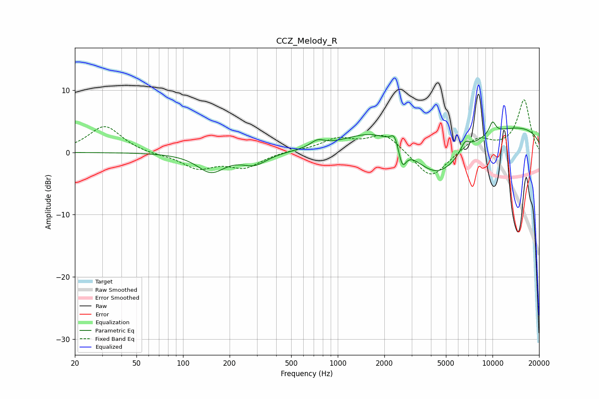

# CCZ_Melody_R
See [usage instructions](https://github.com/jaakkopasanen/AutoEq#usage) for more options and info.

### Parametric EQs
Apply preamp of -5.0 dB when using parametric equalizer.

|   # | Type    |   Fc (Hz) |    Q |   Gain (dB) |
|-----|---------|-----------|------|-------------|
|   1 | Peaking |       152 | 1.6  |        -3   |
|   2 | Peaking |       290 | 1.77 |        -1.8 |
|   3 | Peaking |       740 | 3.16 |         1.1 |
|   4 | Peaking |      1703 | 0.75 |         2.9 |
|   5 | Peaking |      2327 | 5.75 |         2   |
|   6 | Peaking |      2614 | 5.88 |        -3.2 |
|   7 | Peaking |      4394 | 0.79 |        -7.6 |
|   8 | Peaking |      6644 | 4.57 |         1.7 |
|   9 | Peaking |     10000 | 0.18 |         4.7 |
|  10 | Peaking |     10000 | 5.83 |         1.9 |

### Fixed Band EQs
When using fixed band (also called graphic) equalizer, apply preamp of **-8.5 dB** (if available) and set gains manually with these parameters.

|   # | Type    |   Fc (Hz) |    Q |   Gain (dB) |
|-----|---------|-----------|------|-------------|
|   1 | Peaking |        31 | 1.41 |         4.3 |
|   2 | Peaking |        62 | 1.41 |        -0.3 |
|   3 | Peaking |       125 | 1.41 |        -2.4 |
|   4 | Peaking |       250 | 1.41 |        -2.3 |
|   5 | Peaking |       500 | 1.41 |         0.3 |
|   6 | Peaking |      1000 | 1.41 |         2   |
|   7 | Peaking |      2000 | 1.41 |         3   |
|   8 | Peaking |      4000 | 1.41 |        -4.5 |
|   9 | Peaking |      8000 | 1.41 |         2.3 |
|  10 | Peaking |     16000 | 1.41 |         8.4 |

### Graphs

