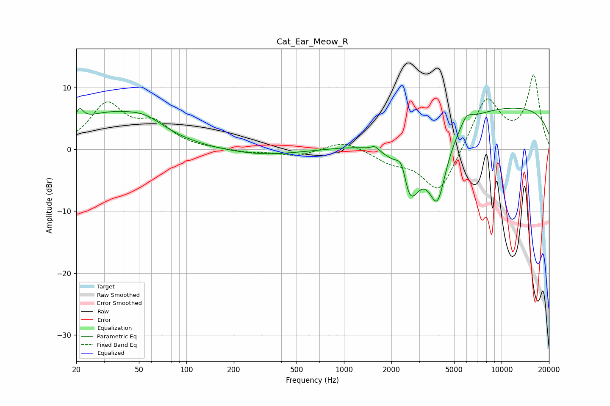

# Cat_Ear_Meow_R
See [usage instructions](https://github.com/jaakkopasanen/AutoEq#usage) for more options and info.

### Parametric EQs
Apply preamp of -6.7 dB when using parametric equalizer.

|   # | Type    |   Fc (Hz) |    Q |   Gain (dB) |
|-----|---------|-----------|------|-------------|
|   1 | Peaking |        21 | 5.96 |         2   |
|   2 | Peaking |        32 | 0.55 |         5.4 |
|   3 | Peaking |        55 | 1.19 |         1.8 |
|   4 | Peaking |       304 | 0.57 |        -1   |
|   5 | Peaking |      1572 | 5.94 |         0.7 |
|   6 | Peaking |      2340 | 3.69 |         5.2 |
|   7 | Peaking |      2575 | 1.97 |       -12.2 |
|   8 | Peaking |      3920 | 2.33 |       -11   |
|   9 | Peaking |      5995 | 3.68 |         1.7 |
|  10 | Peaking |     10000 | 0.18 |         7   |

### Fixed Band EQs
When using fixed band (also called graphic) equalizer, apply preamp of **-12.1 dB** (if available) and set gains manually with these parameters.

|   # | Type    |   Fc (Hz) |    Q |   Gain (dB) |
|-----|---------|-----------|------|-------------|
|   1 | Peaking |        31 | 1.41 |         7   |
|   2 | Peaking |        62 | 1.41 |         3.6 |
|   3 | Peaking |       125 | 1.41 |         0   |
|   4 | Peaking |       250 | 1.41 |        -0.5 |
|   5 | Peaking |       500 | 1.41 |        -1.1 |
|   6 | Peaking |      1000 | 1.41 |         1.5 |
|   7 | Peaking |      2000 | 1.41 |        -1.7 |
|   8 | Peaking |      4000 | 1.41 |        -7.4 |
|   9 | Peaking |      8000 | 1.41 |         8.5 |
|  10 | Peaking |     16000 | 1.41 |        11.7 |

### Graphs

