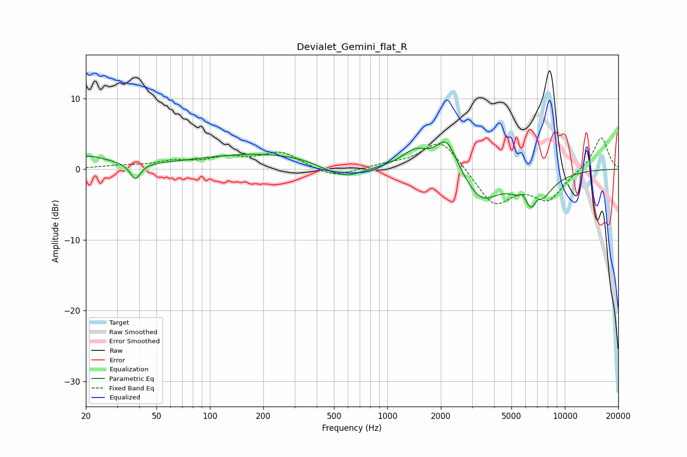

# Devialet_Gemini_flat_R
See [usage instructions](https://github.com/jaakkopasanen/AutoEq#usage) for more options and info.

### Parametric EQs
Apply preamp of -3.9 dB when using parametric equalizer.

|   # | Type    |   Fc (Hz) |    Q |   Gain (dB) |
|-----|---------|-----------|------|-------------|
|   1 | Peaking |        20 | 1.15 |         1.7 |
|   2 | Peaking |        38 | 5    |        -2.3 |
|   3 | Peaking |       224 | 0.33 |         2.3 |
|   4 | Peaking |       561 | 1.14 |        -2.5 |
|   5 | Peaking |      1443 | 1.84 |         2.4 |
|   6 | Peaking |      2158 | 2.44 |         4.6 |
|   7 | Peaking |      3375 | 1.48 |        -4.2 |
|   8 | Peaking |      5824 | 6    |         1.5 |
|   9 | Peaking |      6650 | 1.81 |        -6.1 |
|  10 | Peaking |      6998 | 6    |         1.7 |

### Fixed Band EQs
When using fixed band (also called graphic) equalizer, apply preamp of **-4.5 dB** (if available) and set gains manually with these parameters.

|   # | Type    |   Fc (Hz) |    Q |   Gain (dB) |
|-----|---------|-----------|------|-------------|
|   1 | Peaking |        31 | 1.41 |         0.4 |
|   2 | Peaking |        62 | 1.41 |         0.9 |
|   3 | Peaking |       125 | 1.41 |         1.4 |
|   4 | Peaking |       250 | 1.41 |         2.3 |
|   5 | Peaking |       500 | 1.41 |        -1.3 |
|   6 | Peaking |      1000 | 1.41 |         0.5 |
|   7 | Peaking |      2000 | 1.41 |         4.4 |
|   8 | Peaking |      4000 | 1.41 |        -5.1 |
|   9 | Peaking |      8000 | 1.41 |        -4.1 |
|  10 | Peaking |     16000 | 1.41 |         4.7 |

### Graphs

