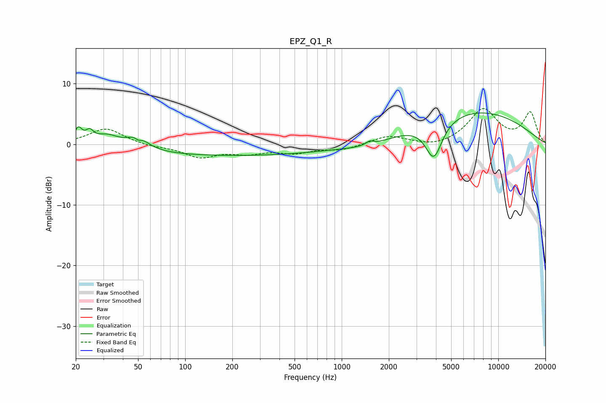

# EPZ_Q1_R
See [usage instructions](https://github.com/jaakkopasanen/AutoEq#usage) for more options and info.

### Parametric EQs
Apply preamp of -5.3 dB when using parametric equalizer.

|   # | Type    |   Fc (Hz) |    Q |   Gain (dB) |
|-----|---------|-----------|------|-------------|
|   1 | Peaking |        21 | 5.95 |         2.4 |
|   2 | Peaking |        25 | 5.8  |         1.5 |
|   3 | Peaking |        32 | 1.75 |         1.9 |
|   4 | Peaking |        50 | 2.44 |         2.4 |
|   5 | Peaking |        50 | 5.99 |        -0.9 |
|   6 | Peaking |       189 | 0.19 |        -1.9 |
|   7 | Peaking |      1489 | 0.95 |        -0.8 |
|   8 | Peaking |      1508 | 5.98 |         0.6 |
|   9 | Peaking |      3874 | 2.61 |        -6.2 |
|  10 | Peaking |      6879 | 0.36 |         5.6 |

### Fixed Band EQs
When using fixed band (also called graphic) equalizer, apply preamp of **-6.0 dB** (if available) and set gains manually with these parameters.

|   # | Type    |   Fc (Hz) |    Q |   Gain (dB) |
|-----|---------|-----------|------|-------------|
|   1 | Peaking |        31 | 1.41 |         2.6 |
|   2 | Peaking |        62 | 1.41 |        -0.4 |
|   3 | Peaking |       125 | 1.41 |        -2   |
|   4 | Peaking |       250 | 1.41 |        -1.2 |
|   5 | Peaking |       500 | 1.41 |        -1.2 |
|   6 | Peaking |      1000 | 1.41 |        -0.9 |
|   7 | Peaking |      2000 | 1.41 |         1.4 |
|   8 | Peaking |      4000 | 1.41 |        -0.6 |
|   9 | Peaking |      8000 | 1.41 |         5.7 |
|  10 | Peaking |     16000 | 1.41 |         5.1 |

### Graphs

