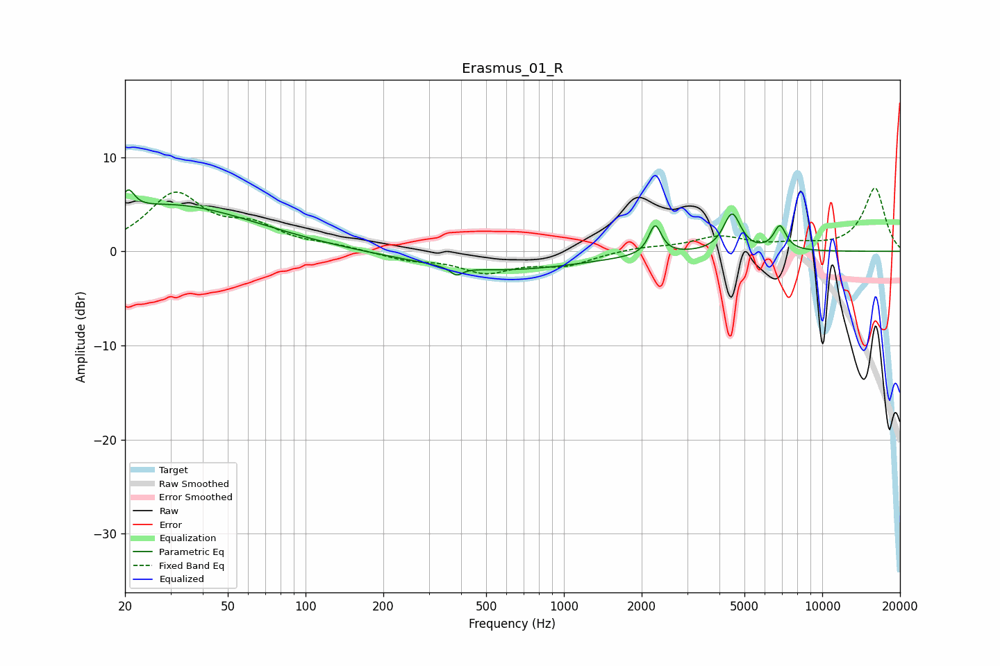

# Erasmus_01_R
See [usage instructions](https://github.com/jaakkopasanen/AutoEq#usage) for more options and info.

### Parametric EQs
Apply preamp of -6.6 dB when using parametric equalizer.

|   # | Type    |   Fc (Hz) |    Q |   Gain (dB) |
|-----|---------|-----------|------|-------------|
|   1 | Peaking |        21 | 5.9  |         2.2 |
|   2 | Peaking |        26 | 0.59 |         1   |
|   3 | Peaking |        32 | 0.42 |         4   |
|   4 | Peaking |       384 | 6    |        -0.9 |
|   5 | Peaking |       559 | 0.43 |        -2   |
|   6 | Peaking |      2039 | 1.26 |         0   |
|   7 | Peaking |      2255 | 6    |         3.1 |
|   8 | Peaking |      4476 | 4.24 |         4   |
|   9 | Peaking |      5408 | 4.6  |        -0.1 |
|  10 | Peaking |      6859 | 5.67 |         2.6 |

### Fixed Band EQs
When using fixed band (also called graphic) equalizer, apply preamp of **-6.8 dB** (if available) and set gains manually with these parameters.

|   # | Type    |   Fc (Hz) |    Q |   Gain (dB) |
|-----|---------|-----------|------|-------------|
|   1 | Peaking |        31 | 1.41 |         5.9 |
|   2 | Peaking |        62 | 1.41 |         2.2 |
|   3 | Peaking |       125 | 1.41 |         0.5 |
|   4 | Peaking |       250 | 1.41 |        -0.8 |
|   5 | Peaking |       500 | 1.41 |        -2.1 |
|   6 | Peaking |      1000 | 1.41 |        -1.4 |
|   7 | Peaking |      2000 | 1.41 |         0.4 |
|   8 | Peaking |      4000 | 1.41 |         1.5 |
|   9 | Peaking |      8000 | 1.41 |         0.6 |
|  10 | Peaking |     16000 | 1.41 |         6.7 |

### Graphs

