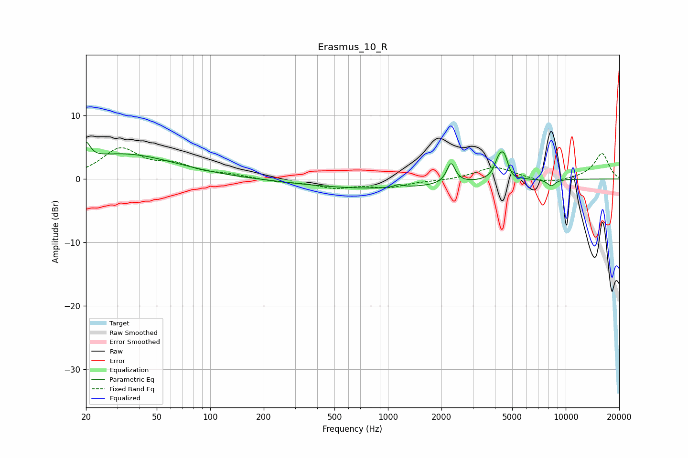

# Erasmus_10_R
See [usage instructions](https://github.com/jaakkopasanen/AutoEq#usage) for more options and info.

### Parametric EQs
Apply preamp of -5.9 dB when using parametric equalizer.

|   # | Type    |   Fc (Hz) |    Q |   Gain (dB) |
|-----|---------|-----------|------|-------------|
|   1 | Peaking |        20 | 6    |         2.7 |
|   2 | Peaking |        25 | 0.7  |         0.6 |
|   3 | Peaking |        35 | 0.5  |         3.4 |
|   4 | Peaking |       822 | 0.36 |        -1.5 |
|   5 | Peaking |      1147 | 6    |         0.4 |
|   6 | Peaking |      2263 | 6    |         3.2 |
|   7 | Peaking |      4190 | 6    |         2   |
|   8 | Peaking |      4501 | 5.15 |         3.8 |
|   9 | Peaking |      4903 | 4.61 |        -0.8 |
|  10 | Peaking |      8302 | 5.58 |        -1   |

### Fixed Band EQs
When using fixed band (also called graphic) equalizer, apply preamp of **-5.0 dB** (if available) and set gains manually with these parameters.

|   # | Type    |   Fc (Hz) |    Q |   Gain (dB) |
|-----|---------|-----------|------|-------------|
|   1 | Peaking |        31 | 1.41 |         4.6 |
|   2 | Peaking |        62 | 1.41 |         1.8 |
|   3 | Peaking |       125 | 1.41 |         0.6 |
|   4 | Peaking |       250 | 1.41 |        -0.4 |
|   5 | Peaking |       500 | 1.41 |        -1.3 |
|   6 | Peaking |      1000 | 1.41 |        -1.2 |
|   7 | Peaking |      2000 | 1.41 |        -0.2 |
|   8 | Peaking |      4000 | 1.41 |         1.9 |
|   9 | Peaking |      8000 | 1.41 |        -0.8 |
|  10 | Peaking |     16000 | 1.41 |         4   |

### Graphs

