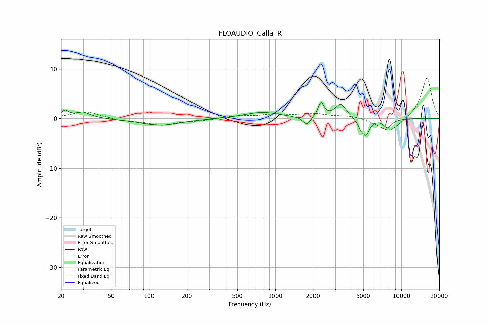

# FLOAUDIO_Calla_R
See [usage instructions](https://github.com/jaakkopasanen/AutoEq#usage) for more options and info.

### Parametric EQs
Apply preamp of -3.3 dB when using parametric equalizer.

|   # | Type    |   Fc (Hz) |    Q |   Gain (dB) |
|-----|---------|-----------|------|-------------|
|   1 | Peaking |        22 | 4.96 |         1.4 |
|   2 | Peaking |        30 | 2.43 |         1.3 |
|   3 | Peaking |       123 | 0.93 |        -1.3 |
|   4 | Peaking |       791 | 1.06 |         1.3 |
|   5 | Peaking |      1789 | 4.55 |        -1.7 |
|   6 | Peaking |      2306 | 5.97 |         3   |
|   7 | Peaking |      3307 | 3.25 |         2.9 |
|   8 | Peaking |      4778 | 6    |        -1.4 |
|   9 | Peaking |      5261 | 4.97 |        -3   |
|  10 | Peaking |      7801 | 3.89 |        -1.8 |

### Fixed Band EQs
When using fixed band (also called graphic) equalizer, apply preamp of **-8.3 dB** (if available) and set gains manually with these parameters.

|   # | Type    |   Fc (Hz) |    Q |   Gain (dB) |
|-----|---------|-----------|------|-------------|
|   1 | Peaking |        31 | 1.41 |         1.4 |
|   2 | Peaking |        62 | 1.41 |        -0.4 |
|   3 | Peaking |       125 | 1.41 |        -1.3 |
|   4 | Peaking |       250 | 1.41 |        -0.3 |
|   5 | Peaking |       500 | 1.41 |         0.5 |
|   6 | Peaking |      1000 | 1.41 |         0.7 |
|   7 | Peaking |      2000 | 1.41 |         0.9 |
|   8 | Peaking |      4000 | 1.41 |         0.5 |
|   9 | Peaking |      8000 | 1.41 |        -2.9 |
|  10 | Peaking |     16000 | 1.41 |         8.4 |

### Graphs

