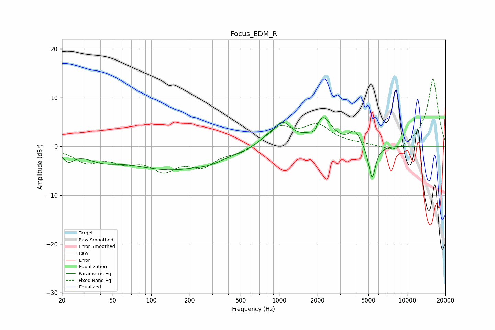

# Focus_EDM_R
See [usage instructions](https://github.com/jaakkopasanen/AutoEq#usage) for more options and info.

### Parametric EQs
Apply preamp of -6.0 dB when using parametric equalizer.

|   # | Type    |   Fc (Hz) |    Q |   Gain (dB) |
|-----|---------|-----------|------|-------------|
|   1 | Peaking |        22 | 3.17 |        -2.1 |
|   2 | Peaking |        41 | 1.2  |        -1.7 |
|   3 | Peaking |       142 | 0.42 |        -4.6 |
|   4 | Peaking |       292 | 1.44 |        -0.7 |
|   5 | Peaking |       755 | 2.47 |         0.8 |
|   6 | Peaking |      1057 | 1.93 |         4.7 |
|   7 | Peaking |      1887 | 4.9  |        -1.5 |
|   8 | Peaking |      2194 | 2.09 |         5.9 |
|   9 | Peaking |      3905 | 3.26 |         2.9 |
|  10 | Peaking |      5332 | 5.06 |        -7.1 |

### Fixed Band EQs
When using fixed band (also called graphic) equalizer, apply preamp of **-13.8 dB** (if available) and set gains manually with these parameters.

|   # | Type    |   Fc (Hz) |    Q |   Gain (dB) |
|-----|---------|-----------|------|-------------|
|   1 | Peaking |        31 | 1.41 |        -2.9 |
|   2 | Peaking |        62 | 1.41 |        -2.5 |
|   3 | Peaking |       125 | 1.41 |        -4.2 |
|   4 | Peaking |       250 | 1.41 |        -3.6 |
|   5 | Peaking |       500 | 1.41 |        -1.3 |
|   6 | Peaking |      1000 | 1.41 |         3.8 |
|   7 | Peaking |      2000 | 1.41 |         4   |
|   8 | Peaking |      4000 | 1.41 |         0.3 |
|   9 | Peaking |      8000 | 1.41 |        -1.6 |
|  10 | Peaking |     16000 | 1.41 |        13.9 |

### Graphs

