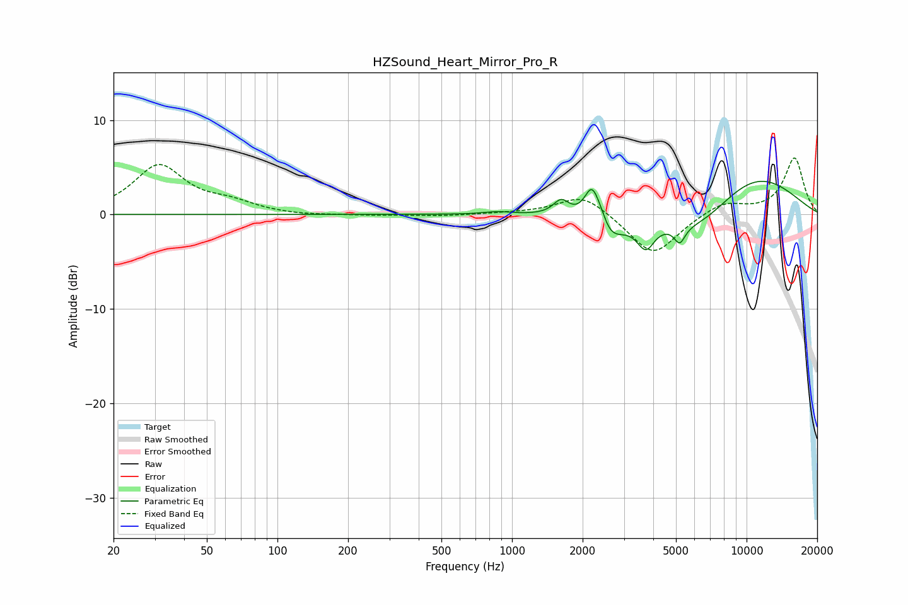

# HZSound_Heart_Mirror_Pro_R
See [usage instructions](https://github.com/jaakkopasanen/AutoEq#usage) for more options and info.

### Parametric EQs
Apply preamp of -3.6 dB when using parametric equalizer.

|   # | Type    |   Fc (Hz) |    Q |   Gain (dB) |
|-----|---------|-----------|------|-------------|
|   1 | Peaking |       415 | 1.41 |         0   |
|   2 | Peaking |       869 | 2.37 |         0.3 |
|   3 | Peaking |      1621 | 4.25 |         1.6 |
|   4 | Peaking |      2197 | 4.35 |         4   |
|   5 | Peaking |      2406 | 5.96 |         0.9 |
|   6 | Peaking |      2578 | 2.25 |        -2.7 |
|   7 | Peaking |      3718 | 3.72 |        -2.8 |
|   8 | Peaking |      5186 | 5.91 |        -1.8 |
|   9 | Peaking |      6320 | 0.83 |        -3.9 |
|  10 | Peaking |     10000 | 0.53 |         5.1 |

### Fixed Band EQs
When using fixed band (also called graphic) equalizer, apply preamp of **-6.1 dB** (if available) and set gains manually with these parameters.

|   # | Type    |   Fc (Hz) |    Q |   Gain (dB) |
|-----|---------|-----------|------|-------------|
|   1 | Peaking |        31 | 1.41 |         5.1 |
|   2 | Peaking |        62 | 1.41 |         1   |
|   3 | Peaking |       125 | 1.41 |        -0.2 |
|   4 | Peaking |       250 | 1.41 |        -0.1 |
|   5 | Peaking |       500 | 1.41 |        -0.2 |
|   6 | Peaking |      1000 | 1.41 |         0.1 |
|   7 | Peaking |      2000 | 1.41 |         2.3 |
|   8 | Peaking |      4000 | 1.41 |        -4.4 |
|   9 | Peaking |      8000 | 1.41 |         1.3 |
|  10 | Peaking |     16000 | 1.41 |         6   |

### Graphs

