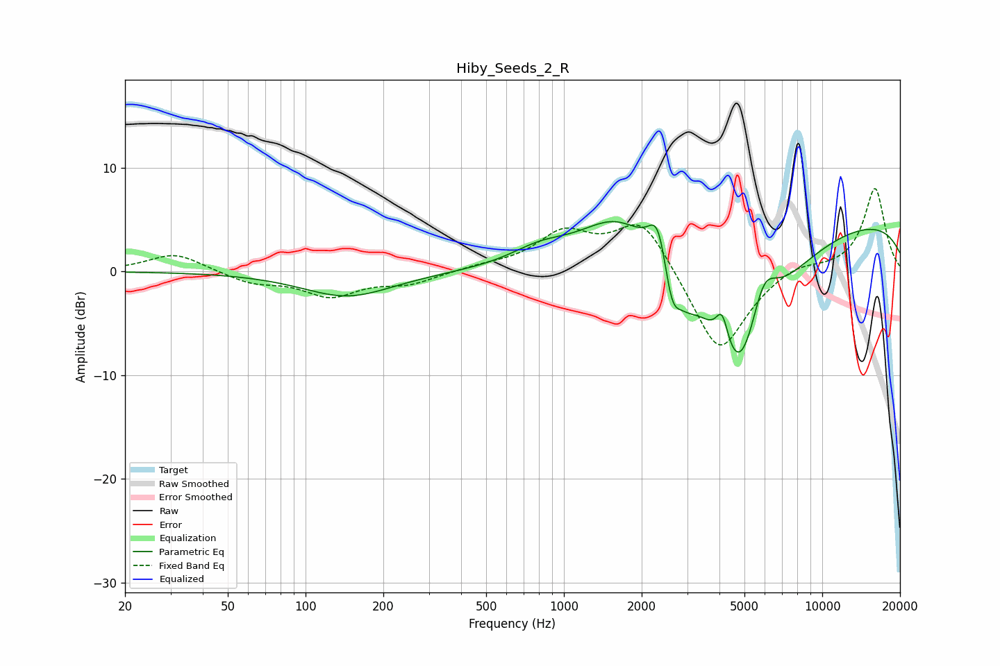

# Hiby_Seeds_2_R
See [usage instructions](https://github.com/jaakkopasanen/AutoEq#usage) for more options and info.

### Parametric EQs
Apply preamp of -4.9 dB when using parametric equalizer.

|   # | Type    |   Fc (Hz) |    Q |   Gain (dB) |
|-----|---------|-----------|------|-------------|
|   1 | Peaking |       145 | 0.81 |        -2.4 |
|   2 | Peaking |       807 | 1.22 |         1.5 |
|   3 | Peaking |      1606 | 0.99 |         4.6 |
|   4 | Peaking |      2314 | 3.9  |         4.4 |
|   5 | Peaking |      2618 | 4.6  |        -3.9 |
|   6 | Peaking |      2977 | 3.02 |        -1.7 |
|   7 | Peaking |      4099 | 5.83 |         3.3 |
|   8 | Peaking |      4801 | 1.02 |       -15.7 |
|   9 | Peaking |      5909 | 2.57 |         5.2 |
|  10 | Peaking |     10000 | 0.18 |         5.3 |

### Fixed Band EQs
When using fixed band (also called graphic) equalizer, apply preamp of **-8.1 dB** (if available) and set gains manually with these parameters.

|   # | Type    |   Fc (Hz) |    Q |   Gain (dB) |
|-----|---------|-----------|------|-------------|
|   1 | Peaking |        31 | 1.41 |         1.8 |
|   2 | Peaking |        62 | 1.41 |        -1.1 |
|   3 | Peaking |       125 | 1.41 |        -2.2 |
|   4 | Peaking |       250 | 1.41 |        -1.1 |
|   5 | Peaking |       500 | 1.41 |         0.4 |
|   6 | Peaking |      1000 | 1.41 |         3.5 |
|   7 | Peaking |      2000 | 1.41 |         5.2 |
|   8 | Peaking |      4000 | 1.41 |        -8.3 |
|   9 | Peaking |      8000 | 1.41 |         0.9 |
|  10 | Peaking |     16000 | 1.41 |         8.1 |

### Graphs

