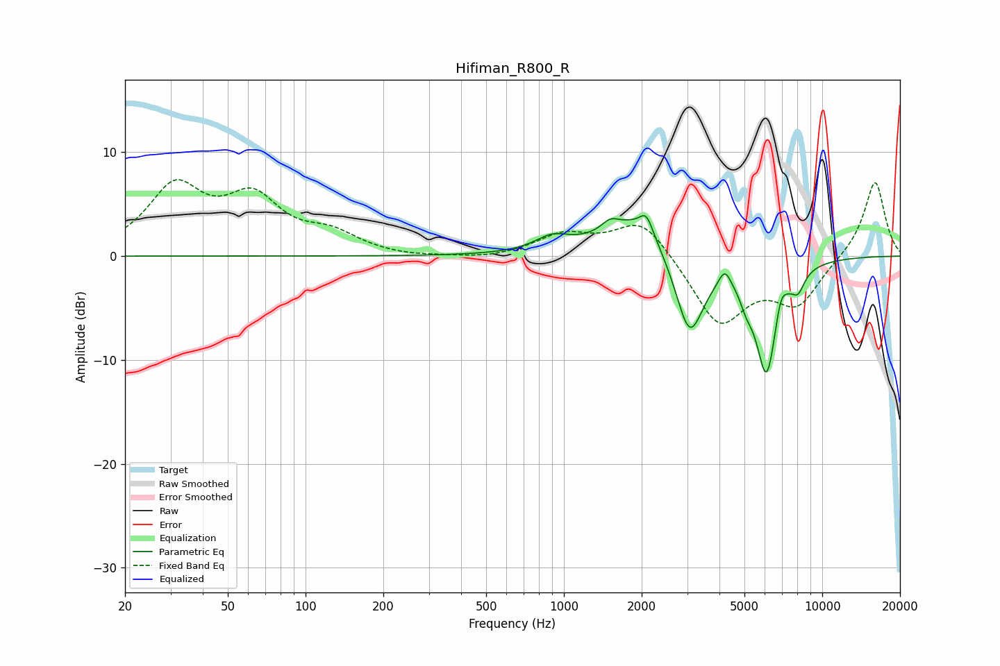

# Hifiman_R800_R
See [usage instructions](https://github.com/jaakkopasanen/AutoEq#usage) for more options and info.

### Parametric EQs
Apply preamp of -4.0 dB when using parametric equalizer.

|   # | Type    |   Fc (Hz) |    Q |   Gain (dB) |
|-----|---------|-----------|------|-------------|
|   1 | Peaking |       900 | 2.15 |         1.3 |
|   2 | Peaking |      1510 | 4.52 |         0.9 |
|   3 | Peaking |      1924 | 1.07 |         3.9 |
|   4 | Peaking |      2086 | 5.57 |         1.8 |
|   5 | Peaking |      3064 | 2.45 |        -8.3 |
|   6 | Peaking |      4196 | 6    |         1.6 |
|   7 | Peaking |      5079 | 6    |        -1.3 |
|   8 | Peaking |      6090 | 3.08 |       -11.3 |
|   9 | Peaking |      6902 | 6    |         2.2 |
|  10 | Peaking |      8070 | 5.5  |        -1.6 |

### Fixed Band EQs
When using fixed band (also called graphic) equalizer, apply preamp of **-7.4 dB** (if available) and set gains manually with these parameters.

|   # | Type    |   Fc (Hz) |    Q |   Gain (dB) |
|-----|---------|-----------|------|-------------|
|   1 | Peaking |        31 | 1.41 |         6.3 |
|   2 | Peaking |        62 | 1.41 |         5   |
|   3 | Peaking |       125 | 1.41 |         1.8 |
|   4 | Peaking |       250 | 1.41 |        -0.2 |
|   5 | Peaking |       500 | 1.41 |        -0.3 |
|   6 | Peaking |      1000 | 1.41 |         2   |
|   7 | Peaking |      2000 | 1.41 |         3.8 |
|   8 | Peaking |      4000 | 1.41 |        -6.6 |
|   9 | Peaking |      8000 | 1.41 |        -4.4 |
|  10 | Peaking |     16000 | 1.41 |         7.4 |

### Graphs

