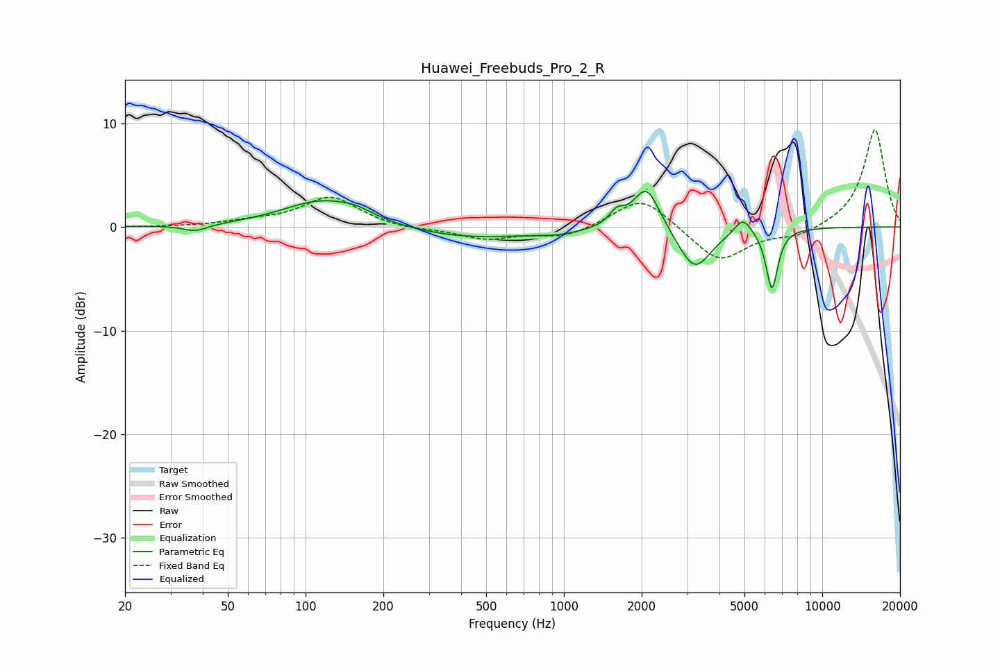

# Huawei_Freebuds_Pro_2_R
See [usage instructions](https://github.com/jaakkopasanen/AutoEq#usage) for more options and info.

### Parametric EQs
Apply preamp of -3.5 dB when using parametric equalizer.

|   # | Type    |   Fc (Hz) |    Q |   Gain (dB) |
|-----|---------|-----------|------|-------------|
|   1 | Peaking |        38 | 2.97 |        -0.6 |
|   2 | Peaking |       116 | 0.93 |         2.6 |
|   3 | Peaking |       158 | 2.22 |         0.5 |
|   4 | Peaking |       421 | 0.59 |        -1.1 |
|   5 | Peaking |       954 | 1.58 |        -0.4 |
|   6 | Peaking |      1600 | 4.99 |         1.2 |
|   7 | Peaking |      2088 | 2.74 |         4.3 |
|   8 | Peaking |      3207 | 2.22 |        -4.2 |
|   9 | Peaking |      4928 | 4.32 |         1.6 |
|  10 | Peaking |      6387 | 6    |        -5.9 |

### Fixed Band EQs
When using fixed band (also called graphic) equalizer, apply preamp of **-9.5 dB** (if available) and set gains manually with these parameters.

|   # | Type    |   Fc (Hz) |    Q |   Gain (dB) |
|-----|---------|-----------|------|-------------|
|   1 | Peaking |        31 | 1.41 |        -0   |
|   2 | Peaking |        62 | 1.41 |         0.4 |
|   3 | Peaking |       125 | 1.41 |         2.9 |
|   4 | Peaking |       250 | 1.41 |        -0.3 |
|   5 | Peaking |       500 | 1.41 |        -1.1 |
|   6 | Peaking |      1000 | 1.41 |        -1   |
|   7 | Peaking |      2000 | 1.41 |         3.1 |
|   8 | Peaking |      4000 | 1.41 |        -3.4 |
|   9 | Peaking |      8000 | 1.41 |        -0.9 |
|  10 | Peaking |     16000 | 1.41 |         9.5 |

### Graphs

