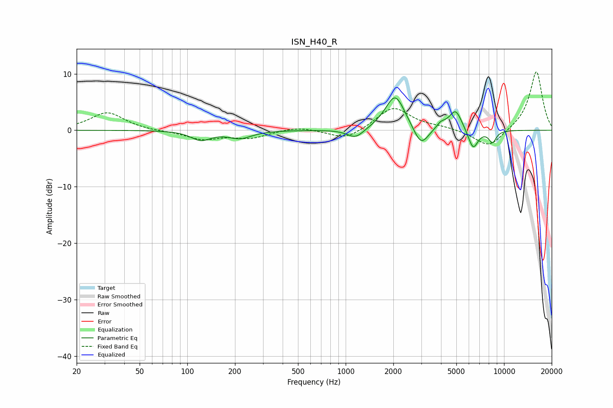

# ISN_H40_R
See [usage instructions](https://github.com/jaakkopasanen/AutoEq#usage) for more options and info.

### Parametric EQs
Apply preamp of -5.8 dB when using parametric equalizer.

|   # | Type    |   Fc (Hz) |    Q |   Gain (dB) |
|-----|---------|-----------|------|-------------|
|   1 | Peaking |       122 | 2.27 |        -1.7 |
|   2 | Peaking |       177 | 0.67 |         0.1 |
|   3 | Peaking |       215 | 1.86 |        -1.4 |
|   4 | Peaking |      1156 | 2.64 |        -1.7 |
|   5 | Peaking |      2054 | 2.25 |         6.4 |
|   6 | Peaking |      2990 | 2.97 |        -3.6 |
|   7 | Peaking |      3999 | 4.76 |         1   |
|   8 | Peaking |      4943 | 3.45 |         3.6 |
|   9 | Peaking |      6378 | 4.35 |        -3.6 |
|  10 | Peaking |      8455 | 5.53 |        -2.1 |

### Fixed Band EQs
When using fixed band (also called graphic) equalizer, apply preamp of **-10.4 dB** (if available) and set gains manually with these parameters.

|   # | Type    |   Fc (Hz) |    Q |   Gain (dB) |
|-----|---------|-----------|------|-------------|
|   1 | Peaking |        31 | 1.41 |         3.2 |
|   2 | Peaking |        62 | 1.41 |        -0.1 |
|   3 | Peaking |       125 | 1.41 |        -1.5 |
|   4 | Peaking |       250 | 1.41 |        -1.3 |
|   5 | Peaking |       500 | 1.41 |         0.7 |
|   6 | Peaking |      1000 | 1.41 |        -1.8 |
|   7 | Peaking |      2000 | 1.41 |         4.1 |
|   8 | Peaking |      4000 | 1.41 |         0.5 |
|   9 | Peaking |      8000 | 1.41 |        -3.2 |
|  10 | Peaking |     16000 | 1.41 |        10.6 |

### Graphs

