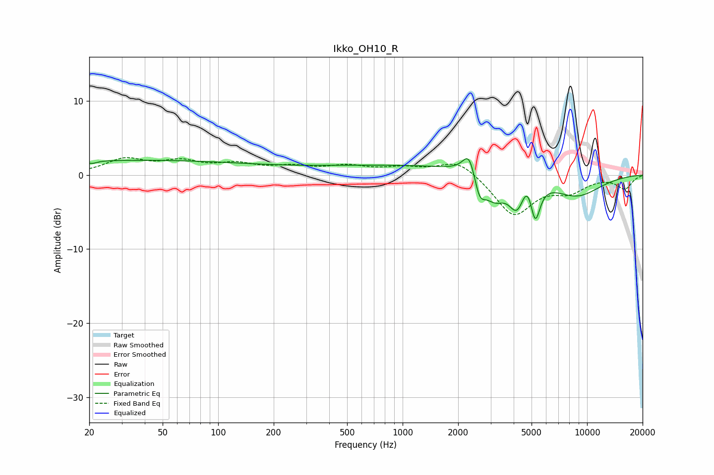

# Ikko_OH10_R
See [usage instructions](https://github.com/jaakkopasanen/AutoEq#usage) for more options and info.

### Parametric EQs
Apply preamp of -2.3 dB when using parametric equalizer.

|   # | Type    |   Fc (Hz) |    Q |   Gain (dB) |
|-----|---------|-----------|------|-------------|
|   1 | Peaking |        21 | 5.74 |        -0.3 |
|   2 | Peaking |        34 | 0.19 |         2   |
|   3 | Peaking |      1429 | 0.18 |         1.4 |
|   4 | Peaking |      2302 | 4.05 |         3.4 |
|   5 | Peaking |      2607 | 4.54 |        -3.3 |
|   6 | Peaking |      3149 | 2.41 |        -3.3 |
|   7 | Peaking |      4185 | 3.08 |        -4.6 |
|   8 | Peaking |      4762 | 3.7  |         3   |
|   9 | Peaking |      5229 | 5.12 |        -5.6 |
|  10 | Peaking |      8675 | 0.91 |        -3.1 |

### Fixed Band EQs
When using fixed band (also called graphic) equalizer, apply preamp of **-2.4 dB** (if available) and set gains manually with these parameters.

|   # | Type    |   Fc (Hz) |    Q |   Gain (dB) |
|-----|---------|-----------|------|-------------|
|   1 | Peaking |        31 | 1.41 |         2   |
|   2 | Peaking |        62 | 1.41 |         1.6 |
|   3 | Peaking |       125 | 1.41 |         1.2 |
|   4 | Peaking |       250 | 1.41 |         0.9 |
|   5 | Peaking |       500 | 1.41 |         1   |
|   6 | Peaking |      1000 | 1.41 |         0.8 |
|   7 | Peaking |      2000 | 1.41 |         2.1 |
|   8 | Peaking |      4000 | 1.41 |        -5.4 |
|   9 | Peaking |      8000 | 1.41 |        -1.9 |
|  10 | Peaking |     16000 | 1.41 |        -1.8 |

### Graphs

