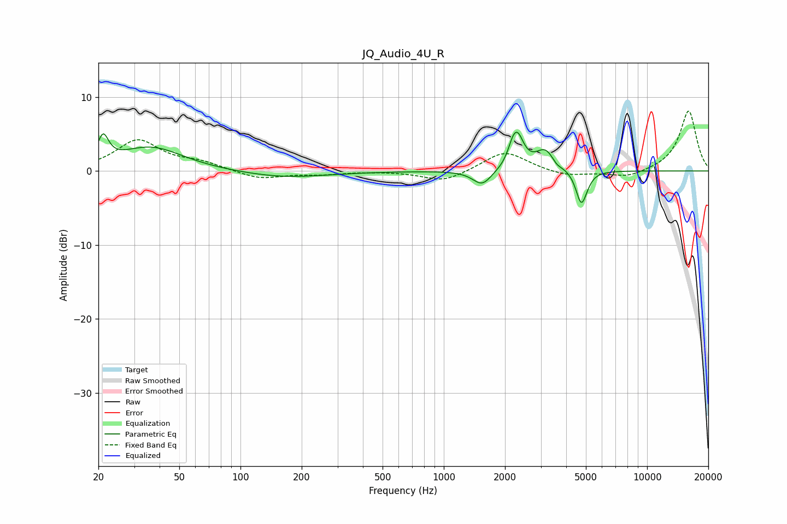

# JQ_Audio_4U_R
See [usage instructions](https://github.com/jaakkopasanen/AutoEq#usage) for more options and info.

### Parametric EQs
Apply preamp of -5.3 dB when using parametric equalizer.

|   # | Type    |   Fc (Hz) |    Q |   Gain (dB) |
|-----|---------|-----------|------|-------------|
|   1 | Peaking |        21 | 5.42 |         3.4 |
|   2 | Peaking |        36 | 0.89 |         3.2 |
|   3 | Peaking |       163 | 0.66 |        -0.9 |
|   4 | Peaking |      1544 | 3.08 |        -2   |
|   5 | Peaking |      2179 | 5.93 |         1.5 |
|   6 | Peaking |      2306 | 4.47 |         4   |
|   7 | Peaking |      3162 | 2.92 |         2.8 |
|   8 | Peaking |      3588 | 6    |        -0.6 |
|   9 | Peaking |      4738 | 5.44 |        -4.3 |
|  10 | Peaking |      5020 | 5.52 |        -0.5 |

### Fixed Band EQs
When using fixed band (also called graphic) equalizer, apply preamp of **-8.2 dB** (if available) and set gains manually with these parameters.

|   # | Type    |   Fc (Hz) |    Q |   Gain (dB) |
|-----|---------|-----------|------|-------------|
|   1 | Peaking |        31 | 1.41 |         4.1 |
|   2 | Peaking |        62 | 1.41 |         1   |
|   3 | Peaking |       125 | 1.41 |        -1.1 |
|   4 | Peaking |       250 | 1.41 |        -0.4 |
|   5 | Peaking |       500 | 1.41 |         0   |
|   6 | Peaking |      1000 | 1.41 |        -1.5 |
|   7 | Peaking |      2000 | 1.41 |         2.8 |
|   8 | Peaking |      4000 | 1.41 |        -0.8 |
|   9 | Peaking |      8000 | 1.41 |        -1   |
|  10 | Peaking |     16000 | 1.41 |         8.2 |

### Graphs

