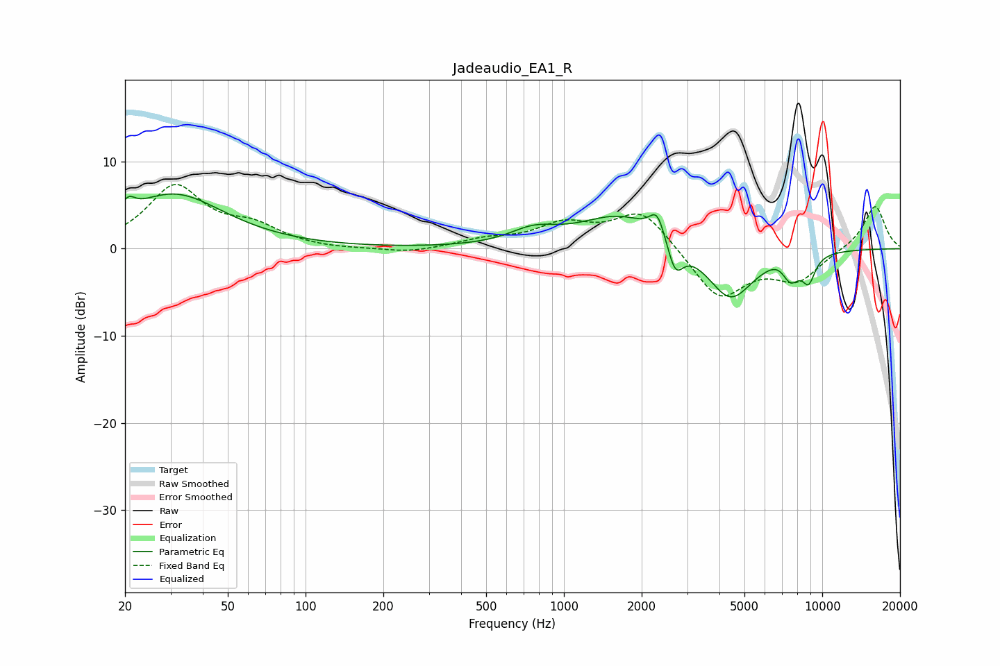

# Jadeaudio_EA1_R
See [usage instructions](https://github.com/jaakkopasanen/AutoEq#usage) for more options and info.

### Parametric EQs
Apply preamp of -6.4 dB when using parametric equalizer.

|   # | Type    |   Fc (Hz) |    Q |   Gain (dB) |
|-----|---------|-----------|------|-------------|
|   1 | Peaking |        21 | 5.65 |         1.5 |
|   2 | Peaking |        31 | 0.73 |         6.2 |
|   3 | Peaking |       763 | 1.54 |         1.6 |
|   4 | Peaking |      1660 | 0.9  |         3.8 |
|   5 | Peaking |      2299 | 4.8  |         2.9 |
|   6 | Peaking |      2698 | 4.66 |        -3.5 |
|   7 | Peaking |      4406 | 1.55 |        -6.1 |
|   8 | Peaking |      6976 | 2.83 |         1.2 |
|   9 | Peaking |      7515 | 3.52 |        -3.2 |
|  10 | Peaking |      8863 | 5.07 |        -2.8 |

### Fixed Band EQs
When using fixed band (also called graphic) equalizer, apply preamp of **-7.5 dB** (if available) and set gains manually with these parameters.

|   # | Type    |   Fc (Hz) |    Q |   Gain (dB) |
|-----|---------|-----------|------|-------------|
|   1 | Peaking |        31 | 1.41 |         7   |
|   2 | Peaking |        62 | 1.41 |         2.1 |
|   3 | Peaking |       125 | 1.41 |        -0.2 |
|   4 | Peaking |       250 | 1.41 |        -0.6 |
|   5 | Peaking |       500 | 1.41 |         0.9 |
|   6 | Peaking |      1000 | 1.41 |         2.5 |
|   7 | Peaking |      2000 | 1.41 |         4.5 |
|   8 | Peaking |      4000 | 1.41 |        -5.8 |
|   9 | Peaking |      8000 | 1.41 |        -3.4 |
|  10 | Peaking |     16000 | 1.41 |         5.1 |

### Graphs

