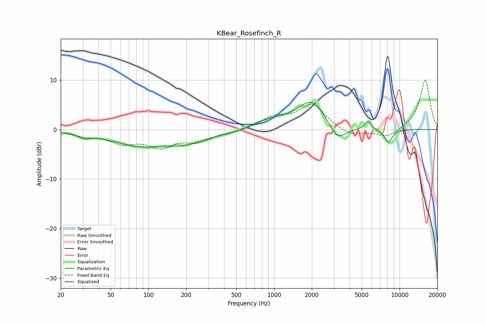

# KBear_Rosefinch_R
See [usage instructions](https://github.com/jaakkopasanen/AutoEq#usage) for more options and info.

### Parametric EQs
Apply preamp of -5.6 dB when using parametric equalizer.

|   # | Type    |   Fc (Hz) |    Q |   Gain (dB) |
|-----|---------|-----------|------|-------------|
|   1 | Peaking |        31 | 3.44 |        -0.8 |
|   2 | Peaking |       103 | 0.51 |        -3.7 |
|   3 | Peaking |       127 | 1.69 |         0.6 |
|   4 | Peaking |       208 | 0.98 |        -1   |
|   5 | Peaking |       459 | 1.34 |        -0.4 |
|   6 | Peaking |       922 | 1    |         1.6 |
|   7 | Peaking |      2019 | 1.2  |         5.9 |
|   8 | Peaking |      3181 | 1.99 |        -3.8 |
|   9 | Peaking |      5604 | 5.97 |         1.7 |
|  10 | Peaking |      8145 | 4.11 |        -2.7 |

### Fixed Band EQs
When using fixed band (also called graphic) equalizer, apply preamp of **-10.1 dB** (if available) and set gains manually with these parameters.

|   # | Type    |   Fc (Hz) |    Q |   Gain (dB) |
|-----|---------|-----------|------|-------------|
|   1 | Peaking |        31 | 1.41 |        -1.1 |
|   2 | Peaking |        62 | 1.41 |        -2.4 |
|   3 | Peaking |       125 | 1.41 |        -3.1 |
|   4 | Peaking |       250 | 1.41 |        -2.1 |
|   5 | Peaking |       500 | 1.41 |        -0.4 |
|   6 | Peaking |      1000 | 1.41 |         2.2 |
|   7 | Peaking |      2000 | 1.41 |         5   |
|   8 | Peaking |      4000 | 1.41 |        -1.4 |
|   9 | Peaking |      8000 | 1.41 |        -1.8 |
|  10 | Peaking |     16000 | 1.41 |        10.1 |

### Graphs

