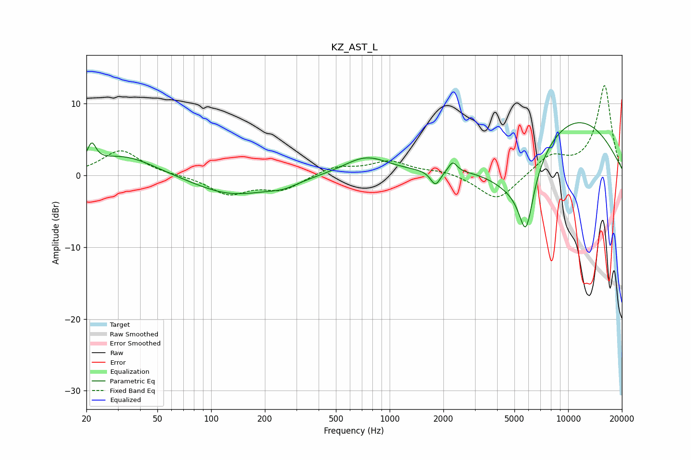

# KZ_AST_L
See [usage instructions](https://github.com/jaakkopasanen/AutoEq#usage) for more options and info.

### Parametric EQs
Apply preamp of -7.4 dB when using parametric equalizer.

|   # | Type    |   Fc (Hz) |    Q |   Gain (dB) |
|-----|---------|-----------|------|-------------|
|   1 | Peaking |        21 | 5.99 |         2.7 |
|   2 | Peaking |        32 | 0.77 |         2.9 |
|   3 | Peaking |       131 | 0.65 |        -2.8 |
|   4 | Peaking |       254 | 1.68 |        -0.8 |
|   5 | Peaking |       738 | 1.12 |         2.6 |
|   6 | Peaking |      1806 | 5.06 |        -2.1 |
|   7 | Peaking |      2255 | 6    |         1.5 |
|   8 | Peaking |      5074 | 0.9  |        -6.3 |
|   9 | Peaking |      5806 | 3.33 |        -8.2 |
|  10 | Peaking |      9814 | 0.37 |         9   |

### Fixed Band EQs
When using fixed band (also called graphic) equalizer, apply preamp of **-12.6 dB** (if available) and set gains manually with these parameters.

|   # | Type    |   Fc (Hz) |    Q |   Gain (dB) |
|-----|---------|-----------|------|-------------|
|   1 | Peaking |        31 | 1.41 |         3.5 |
|   2 | Peaking |        62 | 1.41 |         0   |
|   3 | Peaking |       125 | 1.41 |        -2.6 |
|   4 | Peaking |       250 | 1.41 |        -1.9 |
|   5 | Peaking |       500 | 1.41 |         1.2 |
|   6 | Peaking |      1000 | 1.41 |         1.9 |
|   7 | Peaking |      2000 | 1.41 |         0.6 |
|   8 | Peaking |      4000 | 1.41 |        -3.7 |
|   9 | Peaking |      8000 | 1.41 |         2.6 |
|  10 | Peaking |     16000 | 1.41 |        12.5 |

### Graphs

