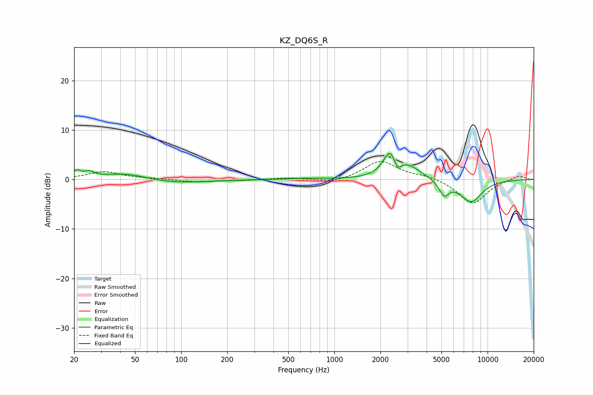

# KZ_DQ6S_R
See [usage instructions](https://github.com/jaakkopasanen/AutoEq#usage) for more options and info.

### Parametric EQs
Apply preamp of -5.3 dB when using parametric equalizer.

|   # | Type    |   Fc (Hz) |    Q |   Gain (dB) |
|-----|---------|-----------|------|-------------|
|   1 | Peaking |        21 | 5.7  |         1.4 |
|   2 | Peaking |        25 | 4.36 |         1.1 |
|   3 | Peaking |        43 | 0.97 |         1.3 |
|   4 | Peaking |        91 | 0.74 |        -0.8 |
|   5 | Peaking |       642 | 1.35 |         0.2 |
|   6 | Peaking |      2300 | 3.38 |         4.5 |
|   7 | Peaking |      2584 | 6    |        -2.1 |
|   8 | Peaking |      2992 | 1.57 |         2.7 |
|   9 | Peaking |      5195 | 4.32 |        -2.9 |
|  10 | Peaking |      7791 | 1.8  |        -4.5 |

### Fixed Band EQs
When using fixed band (also called graphic) equalizer, apply preamp of **-3.7 dB** (if available) and set gains manually with these parameters.

|   # | Type    |   Fc (Hz) |    Q |   Gain (dB) |
|-----|---------|-----------|------|-------------|
|   1 | Peaking |        31 | 1.41 |         1.6 |
|   2 | Peaking |        62 | 1.41 |         0.2 |
|   3 | Peaking |       125 | 1.41 |        -0.5 |
|   4 | Peaking |       250 | 1.41 |        -0.2 |
|   5 | Peaking |       500 | 1.41 |         0.3 |
|   6 | Peaking |      1000 | 1.41 |        -0.8 |
|   7 | Peaking |      2000 | 1.41 |         3.8 |
|   8 | Peaking |      4000 | 1.41 |         0.7 |
|   9 | Peaking |      8000 | 1.41 |        -5   |
|  10 | Peaking |     16000 | 1.41 |         0.9 |

### Graphs

