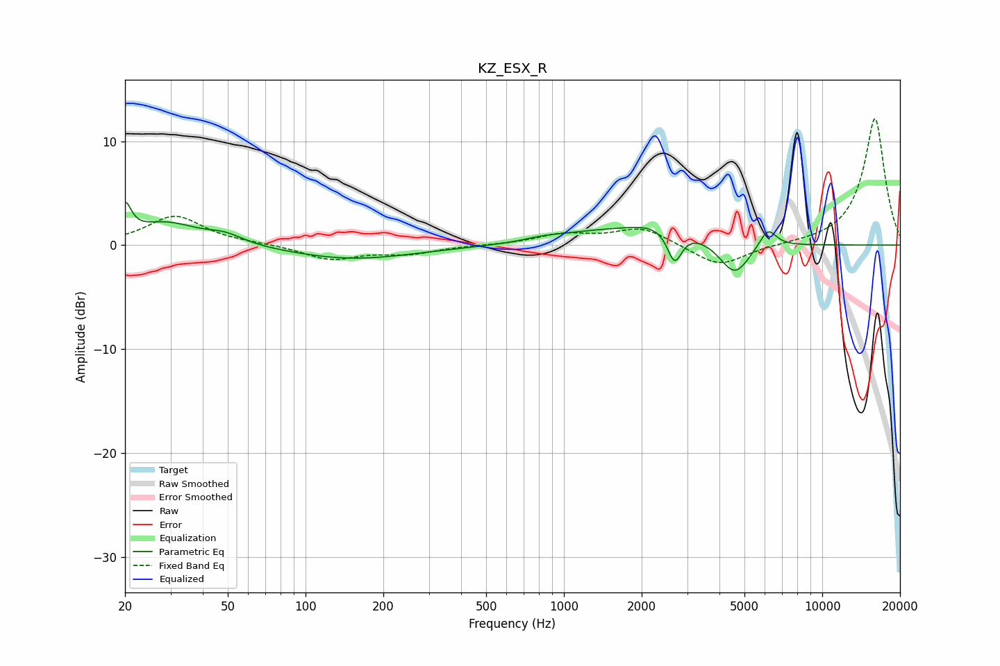

# KZ_ESX_R
See [usage instructions](https://github.com/jaakkopasanen/AutoEq#usage) for more options and info.

### Parametric EQs
Apply preamp of -4.2 dB when using parametric equalizer.

|   # | Type    |   Fc (Hz) |    Q |   Gain (dB) |
|-----|---------|-----------|------|-------------|
|   1 | Peaking |        20 | 6    |         2.9 |
|   2 | Peaking |        29 | 1.13 |         2.1 |
|   3 | Peaking |        49 | 2.05 |         0.8 |
|   4 | Peaking |       150 | 0.58 |        -1.4 |
|   5 | Peaking |       844 | 1.66 |         0.4 |
|   6 | Peaking |      1288 | 1    |         0.7 |
|   7 | Peaking |      2415 | 0.96 |         2   |
|   8 | Peaking |      2682 | 4.99 |        -3.2 |
|   9 | Peaking |      4578 | 2.41 |        -3.3 |
|  10 | Peaking |      6158 | 4.14 |         1.9 |

### Fixed Band EQs
When using fixed band (also called graphic) equalizer, apply preamp of **-12.3 dB** (if available) and set gains manually with these parameters.

|   # | Type    |   Fc (Hz) |    Q |   Gain (dB) |
|-----|---------|-----------|------|-------------|
|   1 | Peaking |        31 | 1.41 |         2.8 |
|   2 | Peaking |        62 | 1.41 |         0.1 |
|   3 | Peaking |       125 | 1.41 |        -1.4 |
|   4 | Peaking |       250 | 1.41 |        -0.8 |
|   5 | Peaking |       500 | 1.41 |        -0   |
|   6 | Peaking |      1000 | 1.41 |         1   |
|   7 | Peaking |      2000 | 1.41 |         1.7 |
|   8 | Peaking |      4000 | 1.41 |        -2.1 |
|   9 | Peaking |      8000 | 1.41 |         0   |
|  10 | Peaking |     16000 | 1.41 |        12.3 |

### Graphs

