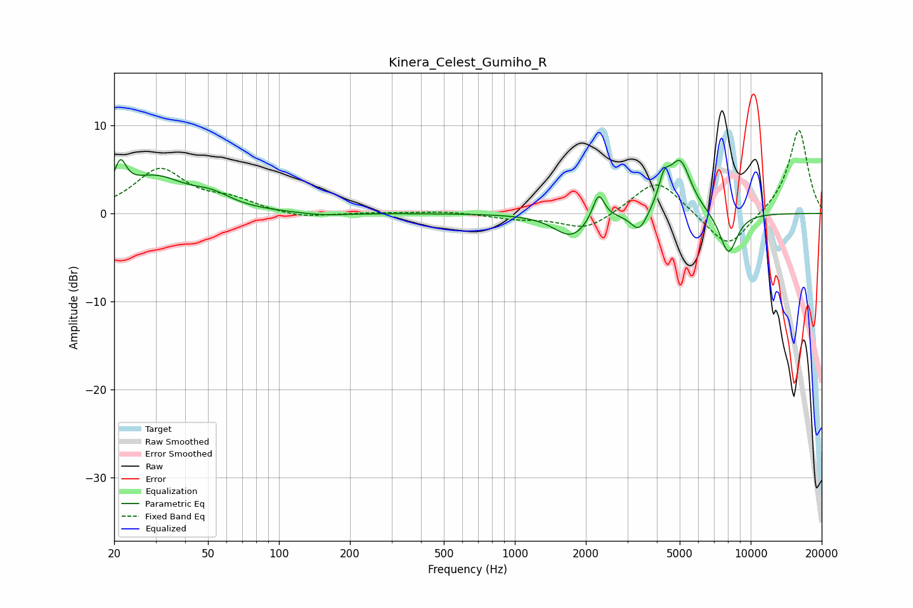

# Kinera_Celest_Gumiho_R
See [usage instructions](https://github.com/jaakkopasanen/AutoEq#usage) for more options and info.

### Parametric EQs
Apply preamp of -6.2 dB when using parametric equalizer.

|   # | Type    |   Fc (Hz) |    Q |   Gain (dB) |
|-----|---------|-----------|------|-------------|
|   1 | Peaking |        21 | 5.59 |         3.5 |
|   2 | Peaking |        30 | 1.07 |         3.9 |
|   3 | Peaking |        52 | 1.75 |         1.2 |
|   4 | Peaking |       154 | 1.43 |        -0.3 |
|   5 | Peaking |      1736 | 1.95 |        -2.7 |
|   6 | Peaking |      2264 | 5.63 |         3.1 |
|   7 | Peaking |      3369 | 3.95 |        -2.4 |
|   8 | Peaking |      4296 | 6    |         2.6 |
|   9 | Peaking |      5013 | 2.91 |         6   |
|  10 | Peaking |      8044 | 3.46 |        -4.8 |

### Fixed Band EQs
When using fixed band (also called graphic) equalizer, apply preamp of **-9.5 dB** (if available) and set gains manually with these parameters.

|   # | Type    |   Fc (Hz) |    Q |   Gain (dB) |
|-----|---------|-----------|------|-------------|
|   1 | Peaking |        31 | 1.41 |         4.9 |
|   2 | Peaking |        62 | 1.41 |         1.3 |
|   3 | Peaking |       125 | 1.41 |        -0.6 |
|   4 | Peaking |       250 | 1.41 |         0.1 |
|   5 | Peaking |       500 | 1.41 |         0.3 |
|   6 | Peaking |      1000 | 1.41 |        -0.5 |
|   7 | Peaking |      2000 | 1.41 |        -1.9 |
|   8 | Peaking |      4000 | 1.41 |         4.1 |
|   9 | Peaking |      8000 | 1.41 |        -4.3 |
|  10 | Peaking |     16000 | 1.41 |         9.7 |

### Graphs

