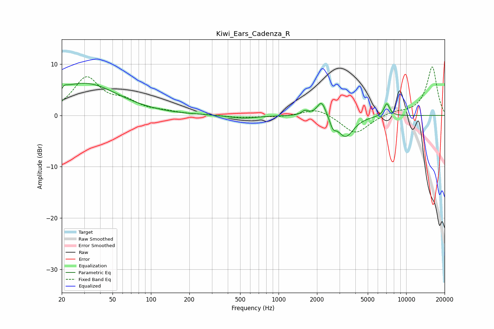

# Kiwi_Ears_Cadenza_R
See [usage instructions](https://github.com/jaakkopasanen/AutoEq#usage) for more options and info.

### Parametric EQs
Apply preamp of -6.3 dB when using parametric equalizer.

|   # | Type    |   Fc (Hz) |    Q |   Gain (dB) |
|-----|---------|-----------|------|-------------|
|   1 | Peaking |        20 | 0.6  |         1.7 |
|   2 | Peaking |        20 | 6    |        -3.2 |
|   3 | Peaking |        20 | 5.96 |         3.2 |
|   4 | Peaking |        33 | 0.58 |         4.9 |
|   5 | Peaking |       528 | 1.39 |        -0.6 |
|   6 | Peaking |      1608 | 5.24 |         0.9 |
|   7 | Peaking |      2174 | 3.95 |         3.3 |
|   8 | Peaking |      2666 | 5.99 |        -1.6 |
|   9 | Peaking |      3348 | 2.22 |        -4.2 |
|  10 | Peaking |      7051 | 5.99 |         2.5 |

### Fixed Band EQs
When using fixed band (also called graphic) equalizer, apply preamp of **-9.5 dB** (if available) and set gains manually with these parameters.

|   # | Type    |   Fc (Hz) |    Q |   Gain (dB) |
|-----|---------|-----------|------|-------------|
|   1 | Peaking |        31 | 1.41 |         7.1 |
|   2 | Peaking |        62 | 1.41 |         2.2 |
|   3 | Peaking |       125 | 1.41 |         0.5 |
|   4 | Peaking |       250 | 1.41 |         0.1 |
|   5 | Peaking |       500 | 1.41 |        -0.4 |
|   6 | Peaking |      1000 | 1.41 |        -0.3 |
|   7 | Peaking |      2000 | 1.41 |         1.5 |
|   8 | Peaking |      4000 | 1.41 |        -3.7 |
|   9 | Peaking |      8000 | 1.41 |         0.7 |
|  10 | Peaking |     16000 | 1.41 |         9.5 |

### Graphs

