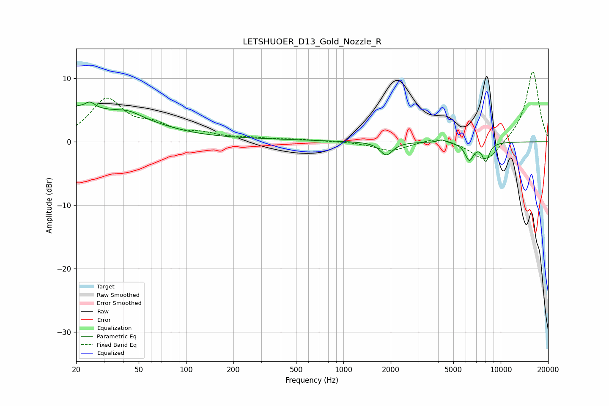

# LETSHUOER_D13_Gold_Nozzle_R
See [usage instructions](https://github.com/jaakkopasanen/AutoEq#usage) for more options and info.

### Parametric EQs
Apply preamp of -6.4 dB when using parametric equalizer.

|   # | Type    |   Fc (Hz) |    Q |   Gain (dB) |
|-----|---------|-----------|------|-------------|
|   1 | Peaking |        20 | 5.5  |         4.2 |
|   2 | Peaking |        20 | 6    |        -3.3 |
|   3 | Peaking |        24 | 4.33 |         1.3 |
|   4 | Peaking |        28 | 0.44 |         4.7 |
|   5 | Peaking |        44 | 2.03 |         0.7 |
|   6 | Peaking |       295 | 0.47 |         0.3 |
|   7 | Peaking |      1875 | 3.63 |        -2.1 |
|   8 | Peaking |      4219 | 5.44 |         0.5 |
|   9 | Peaking |      6311 | 5.04 |        -2.8 |
|  10 | Peaking |      8036 | 5.95 |        -2.8 |

### Fixed Band EQs
When using fixed band (also called graphic) equalizer, apply preamp of **-11.2 dB** (if available) and set gains manually with these parameters.

|   # | Type    |   Fc (Hz) |    Q |   Gain (dB) |
|-----|---------|-----------|------|-------------|
|   1 | Peaking |        31 | 1.41 |         6.5 |
|   2 | Peaking |        62 | 1.41 |         2   |
|   3 | Peaking |       125 | 1.41 |         1   |
|   4 | Peaking |       250 | 1.41 |         0.5 |
|   5 | Peaking |       500 | 1.41 |         0.3 |
|   6 | Peaking |      1000 | 1.41 |         0.1 |
|   7 | Peaking |      2000 | 1.41 |        -1.4 |
|   8 | Peaking |      4000 | 1.41 |         0.9 |
|   9 | Peaking |      8000 | 1.41 |        -3.4 |
|  10 | Peaking |     16000 | 1.41 |        11.3 |

### Graphs

