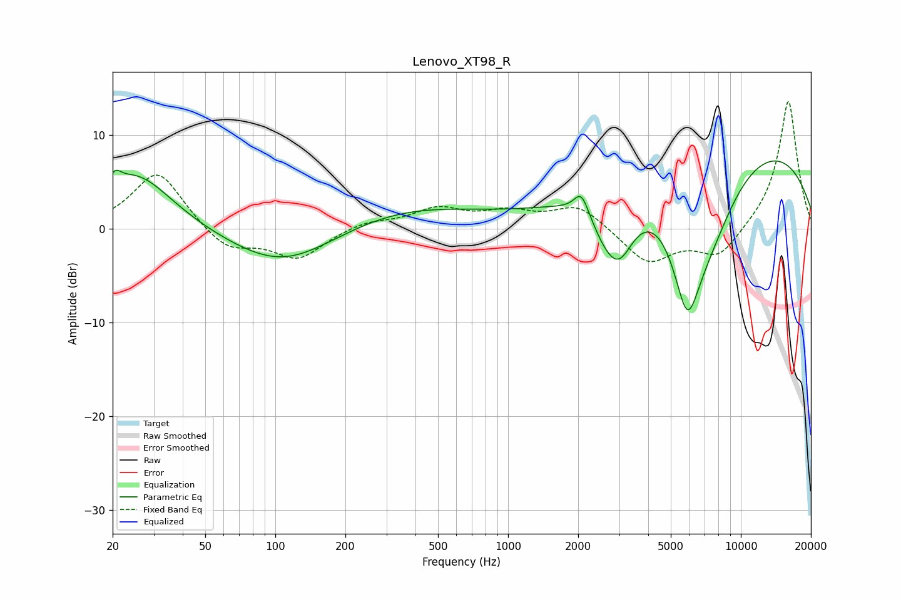

# Lenovo_XT98_R
See [usage instructions](https://github.com/jaakkopasanen/AutoEq#usage) for more options and info.

### Parametric EQs
Apply preamp of -7.4 dB when using parametric equalizer.

|   # | Type    |   Fc (Hz) |    Q |   Gain (dB) |
|-----|---------|-----------|------|-------------|
|   1 | Peaking |        21 | 5.82 |         1.3 |
|   2 | Peaking |        25 | 0.9  |         6   |
|   3 | Peaking |       108 | 0.62 |        -4.3 |
|   4 | Peaking |       354 | 0.43 |         2.4 |
|   5 | Peaking |      2065 | 4.66 |         2.3 |
|   6 | Peaking |      2581 | 2.52 |        -1.9 |
|   7 | Peaking |      2998 | 2.06 |        -6.1 |
|   8 | Peaking |      5886 | 2.07 |       -11.5 |
|   9 | Peaking |      7307 | 0.98 |        -7.5 |
|  10 | Peaking |      9277 | 0.23 |        10.1 |

### Fixed Band EQs
When using fixed band (also called graphic) equalizer, apply preamp of **-13.7 dB** (if available) and set gains manually with these parameters.

|   # | Type    |   Fc (Hz) |    Q |   Gain (dB) |
|-----|---------|-----------|------|-------------|
|   1 | Peaking |        31 | 1.41 |         6.3 |
|   2 | Peaking |        62 | 1.41 |        -2.4 |
|   3 | Peaking |       125 | 1.41 |        -3.1 |
|   4 | Peaking |       250 | 1.41 |         0.8 |
|   5 | Peaking |       500 | 1.41 |         2   |
|   6 | Peaking |      1000 | 1.41 |         1.5 |
|   7 | Peaking |      2000 | 1.41 |         2.5 |
|   8 | Peaking |      4000 | 1.41 |        -3.7 |
|   9 | Peaking |      8000 | 1.41 |        -3.1 |
|  10 | Peaking |     16000 | 1.41 |        13.9 |

### Graphs

