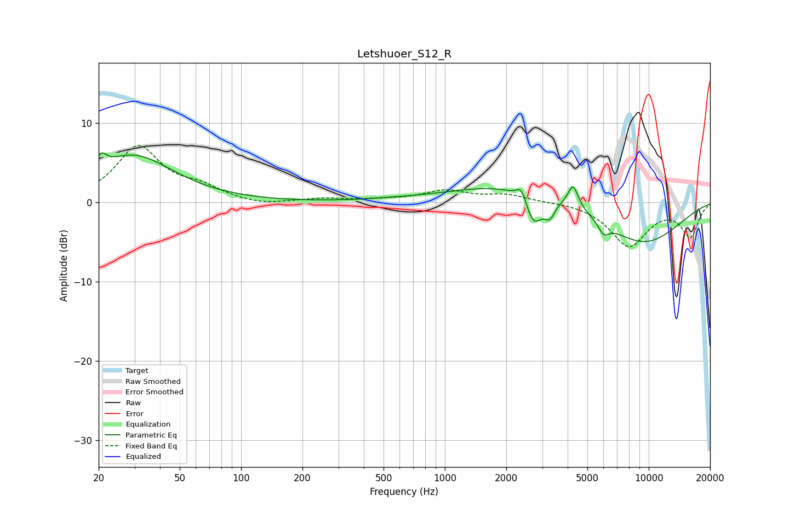

# Letshuoer_S12_R
See [usage instructions](https://github.com/jaakkopasanen/AutoEq#usage) for more options and info.

### Parametric EQs
Apply preamp of -6.4 dB when using parametric equalizer.

|   # | Type    |   Fc (Hz) |    Q |   Gain (dB) |
|-----|---------|-----------|------|-------------|
|   1 | Peaking |        21 | 6    |         1.6 |
|   2 | Peaking |        29 | 0.71 |         5.9 |
|   3 | Peaking |       555 | 0.92 |         0.1 |
|   4 | Peaking |      2251 | 0.47 |         2.5 |
|   5 | Peaking |      2377 | 6    |         1.8 |
|   6 | Peaking |      2721 | 3.33 |        -3.9 |
|   7 | Peaking |      3269 | 5.57 |        -1.9 |
|   8 | Peaking |      4255 | 5.54 |         2.9 |
|   9 | Peaking |      6008 | 5.01 |        -1.5 |
|  10 | Peaking |      9250 | 0.61 |        -5.3 |

### Fixed Band EQs
When using fixed band (also called graphic) equalizer, apply preamp of **-7.3 dB** (if available) and set gains manually with these parameters.

|   # | Type    |   Fc (Hz) |    Q |   Gain (dB) |
|-----|---------|-----------|------|-------------|
|   1 | Peaking |        31 | 1.41 |         6.9 |
|   2 | Peaking |        62 | 1.41 |         1.5 |
|   3 | Peaking |       125 | 1.41 |        -0.5 |
|   4 | Peaking |       250 | 1.41 |         0.4 |
|   5 | Peaking |       500 | 1.41 |         0.3 |
|   6 | Peaking |      1000 | 1.41 |         1.4 |
|   7 | Peaking |      2000 | 1.41 |         0.9 |
|   8 | Peaking |      4000 | 1.41 |         0.1 |
|   9 | Peaking |      8000 | 1.41 |        -5.4 |
|  10 | Peaking |     16000 | 1.41 |        -4.2 |

### Graphs

