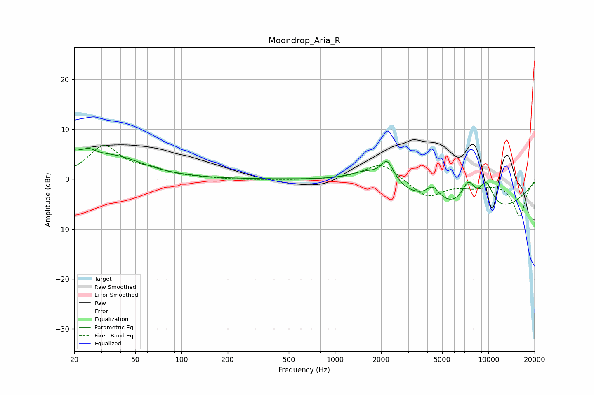

# Moondrop_Aria_R
See [usage instructions](https://github.com/jaakkopasanen/AutoEq#usage) for more options and info.

### Parametric EQs
Apply preamp of -6.3 dB when using parametric equalizer.

|   # | Type    |   Fc (Hz) |    Q |   Gain (dB) |
|-----|---------|-----------|------|-------------|
|   1 | Peaking |        20 | 5.72 |         2.1 |
|   2 | Peaking |        24 | 2.66 |         2.3 |
|   3 | Peaking |        35 | 0.71 |         4.4 |
|   4 | Peaking |      1690 | 1.21 |         3.1 |
|   5 | Peaking |      2012 | 1.49 |        -1.4 |
|   6 | Peaking |      2193 | 3.14 |         4.8 |
|   7 | Peaking |      4354 | 3.22 |         2.7 |
|   8 | Peaking |      7400 | 2.94 |         5   |
|   9 | Peaking |      8680 | 0.33 |        -7.2 |
|  10 | Peaking |      9698 | 2.64 |         5.4 |

### Fixed Band EQs
When using fixed band (also called graphic) equalizer, apply preamp of **-6.8 dB** (if available) and set gains manually with these parameters.

|   # | Type    |   Fc (Hz) |    Q |   Gain (dB) |
|-----|---------|-----------|------|-------------|
|   1 | Peaking |        31 | 1.41 |         6.5 |
|   2 | Peaking |        62 | 1.41 |         1.4 |
|   3 | Peaking |       125 | 1.41 |         0.2 |
|   4 | Peaking |       250 | 1.41 |        -0.1 |
|   5 | Peaking |       500 | 1.41 |        -0.1 |
|   6 | Peaking |      1000 | 1.41 |        -0   |
|   7 | Peaking |      2000 | 1.41 |         3.4 |
|   8 | Peaking |      4000 | 1.41 |        -3.6 |
|   9 | Peaking |      8000 | 1.41 |        -1.2 |
|  10 | Peaking |     16000 | 1.41 |        -7.3 |

### Graphs

