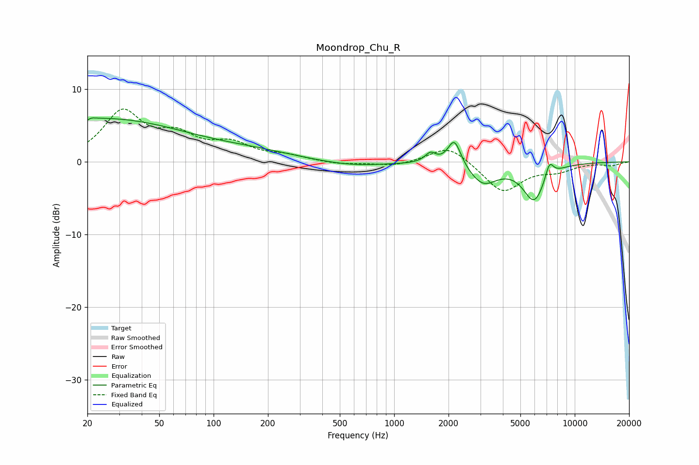

# Moondrop_Chu_R
See [usage instructions](https://github.com/jaakkopasanen/AutoEq#usage) for more options and info.

### Parametric EQs
Apply preamp of -6.2 dB when using parametric equalizer.

|   # | Type    |   Fc (Hz) |    Q |   Gain (dB) |
|-----|---------|-----------|------|-------------|
|   1 | Peaking |        20 | 5.96 |        -3.2 |
|   2 | Peaking |        20 | 5.79 |         3   |
|   3 | Peaking |        24 | 0.28 |         5.9 |
|   4 | Peaking |       174 | 0.59 |         0.9 |
|   5 | Peaking |       582 | 0.76 |        -0.7 |
|   6 | Peaking |      1588 | 4.63 |         1.3 |
|   7 | Peaking |      2154 | 3.93 |         3.7 |
|   8 | Peaking |      3106 | 1.82 |        -2.9 |
|   9 | Peaking |      5962 | 2.24 |        -5.2 |
|  10 | Peaking |      7239 | 5.82 |         2.2 |

### Fixed Band EQs
When using fixed band (also called graphic) equalizer, apply preamp of **-7.4 dB** (if available) and set gains manually with these parameters.

|   # | Type    |   Fc (Hz) |    Q |   Gain (dB) |
|-----|---------|-----------|------|-------------|
|   1 | Peaking |        31 | 1.41 |         6.6 |
|   2 | Peaking |        62 | 1.41 |         3   |
|   3 | Peaking |       125 | 1.41 |         2.2 |
|   4 | Peaking |       250 | 1.41 |         0.7 |
|   5 | Peaking |       500 | 1.41 |        -0.4 |
|   6 | Peaking |      1000 | 1.41 |        -0.6 |
|   7 | Peaking |      2000 | 1.41 |         2.4 |
|   8 | Peaking |      4000 | 1.41 |        -4.2 |
|   9 | Peaking |      8000 | 1.41 |        -1.1 |
|  10 | Peaking |     16000 | 1.41 |        -0.5 |

### Graphs

