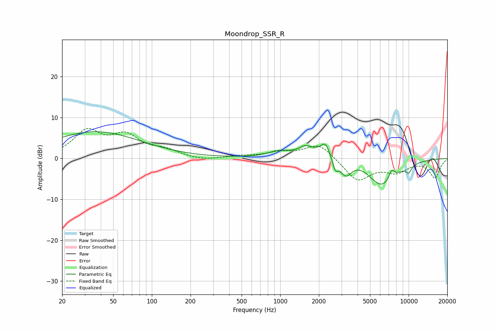

# Moondrop_SSR_R
See [usage instructions](https://github.com/jaakkopasanen/AutoEq#usage) for more options and info.

### Parametric EQs
Apply preamp of -6.6 dB when using parametric equalizer.

|   # | Type    |   Fc (Hz) |    Q |   Gain (dB) |
|-----|---------|-----------|------|-------------|
|   1 | Peaking |        36 | 0.4  |         6.5 |
|   2 | Peaking |       965 | 1.77 |         1.2 |
|   3 | Peaking |      1559 | 3.12 |         1.5 |
|   4 | Peaking |      2241 | 4.59 |         2.3 |
|   5 | Peaking |      2678 | 6    |        -3.3 |
|   6 | Peaking |      2759 | 0.76 |         3.6 |
|   7 | Peaking |      3223 | 2.66 |        -5.6 |
|   8 | Peaking |      6154 | 1.16 |        -7.4 |
|   9 | Peaking |      7374 | 5.95 |         2.4 |
|  10 | Peaking |     10000 | 5.81 |        -1.7 |

### Fixed Band EQs
When using fixed band (also called graphic) equalizer, apply preamp of **-7.4 dB** (if available) and set gains manually with these parameters.

|   # | Type    |   Fc (Hz) |    Q |   Gain (dB) |
|-----|---------|-----------|------|-------------|
|   1 | Peaking |        31 | 1.41 |         6.3 |
|   2 | Peaking |        62 | 1.41 |         5   |
|   3 | Peaking |       125 | 1.41 |         1.7 |
|   4 | Peaking |       250 | 1.41 |        -0.6 |
|   5 | Peaking |       500 | 1.41 |         0.4 |
|   6 | Peaking |      1000 | 1.41 |         1.3 |
|   7 | Peaking |      2000 | 1.41 |         3.7 |
|   8 | Peaking |      4000 | 1.41 |        -5.4 |
|   9 | Peaking |      8000 | 1.41 |        -2.9 |
|  10 | Peaking |     16000 | 1.41 |        -4.6 |

### Graphs

