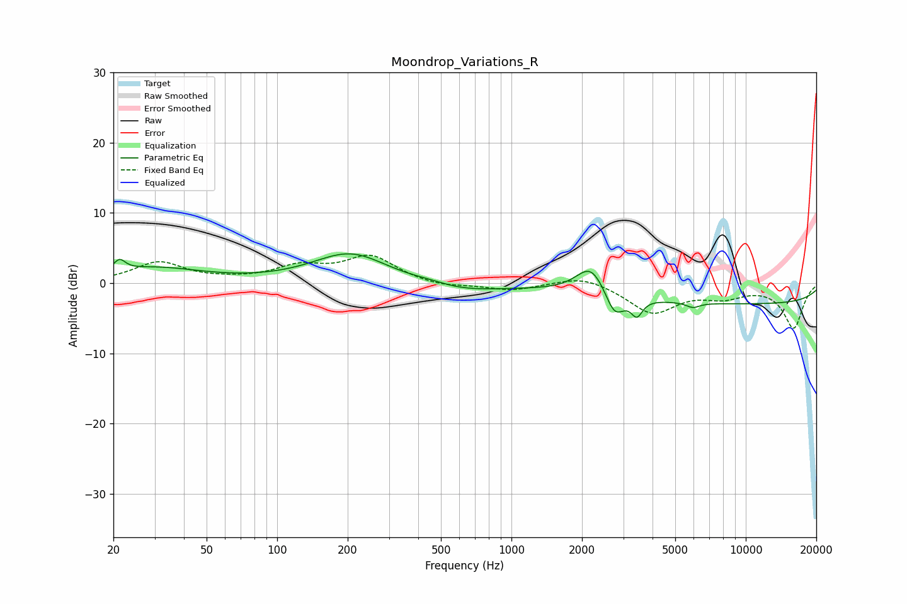

# Moondrop_Variations_R
See [usage instructions](https://github.com/jaakkopasanen/AutoEq#usage) for more options and info.

### Parametric EQs
Apply preamp of -4.3 dB when using parametric equalizer.

|   # | Type    |   Fc (Hz) |    Q |   Gain (dB) |
|-----|---------|-----------|------|-------------|
|   1 | Peaking |        21 | 5.9  |         1.6 |
|   2 | Peaking |        29 | 0.68 |         2.1 |
|   3 | Peaking |       206 | 0.88 |         4.4 |
|   4 | Peaking |       450 | 1.57 |         0.6 |
|   5 | Peaking |       556 | 0.75 |        -1.4 |
|   6 | Peaking |      2187 | 2.26 |         4.2 |
|   7 | Peaking |      2754 | 3.55 |        -3.6 |
|   8 | Peaking |      3429 | 5.97 |        -2.4 |
|   9 | Peaking |      5952 | 4.8  |        -0.7 |
|  10 | Peaking |     10000 | 0.18 |        -2.9 |

### Fixed Band EQs
When using fixed band (also called graphic) equalizer, apply preamp of **-4.1 dB** (if available) and set gains manually with these parameters.

|   # | Type    |   Fc (Hz) |    Q |   Gain (dB) |
|-----|---------|-----------|------|-------------|
|   1 | Peaking |        31 | 1.41 |         2.9 |
|   2 | Peaking |        62 | 1.41 |         0.2 |
|   3 | Peaking |       125 | 1.41 |         2.1 |
|   4 | Peaking |       250 | 1.41 |         3.7 |
|   5 | Peaking |       500 | 1.41 |        -0.6 |
|   6 | Peaking |      1000 | 1.41 |        -1   |
|   7 | Peaking |      2000 | 1.41 |         1.2 |
|   8 | Peaking |      4000 | 1.41 |        -4.2 |
|   9 | Peaking |      8000 | 1.41 |        -1.6 |
|  10 | Peaking |     16000 | 1.41 |        -6.3 |

### Graphs

