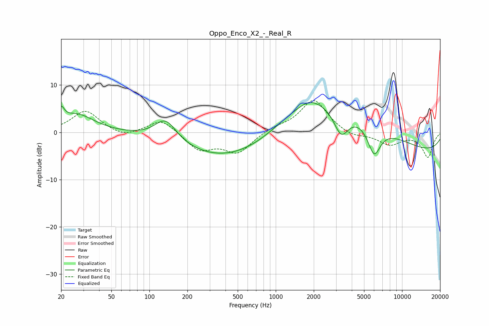

# Oppo_Enco_X2_-_Real_R
See [usage instructions](https://github.com/jaakkopasanen/AutoEq#usage) for more options and info.

### Parametric EQs
Apply preamp of -6.4 dB when using parametric equalizer.

|   # | Type    |   Fc (Hz) |    Q |   Gain (dB) |
|-----|---------|-----------|------|-------------|
|   1 | Peaking |        20 | 5.98 |         2.7 |
|   2 | Peaking |        26 | 1.02 |         3.8 |
|   3 | Peaking |       134 | 1.6  |         4.8 |
|   4 | Peaking |       427 | 0.39 |        -6.9 |
|   5 | Peaking |       819 | 0.6  |        -2.8 |
|   6 | Peaking |      1832 | 2.09 |         1   |
|   7 | Peaking |      2166 | 0.28 |        11.4 |
|   8 | Peaking |      3294 | 2.29 |        -6   |
|   9 | Peaking |      6005 | 2.61 |        -6.5 |
|  10 | Peaking |     10000 | 0.19 |        -4.8 |

### Fixed Band EQs
When using fixed band (also called graphic) equalizer, apply preamp of **-6.8 dB** (if available) and set gains manually with these parameters.

|   # | Type    |   Fc (Hz) |    Q |   Gain (dB) |
|-----|---------|-----------|------|-------------|
|   1 | Peaking |        31 | 1.41 |         4.6 |
|   2 | Peaking |        62 | 1.41 |        -1.2 |
|   3 | Peaking |       125 | 1.41 |         2.9 |
|   4 | Peaking |       250 | 1.41 |        -3.7 |
|   5 | Peaking |       500 | 1.41 |        -4.2 |
|   6 | Peaking |      1000 | 1.41 |         0.9 |
|   7 | Peaking |      2000 | 1.41 |         7   |
|   8 | Peaking |      4000 | 1.41 |        -1.1 |
|   9 | Peaking |      8000 | 1.41 |        -2.5 |
|  10 | Peaking |     16000 | 1.41 |        -5.2 |

### Graphs

